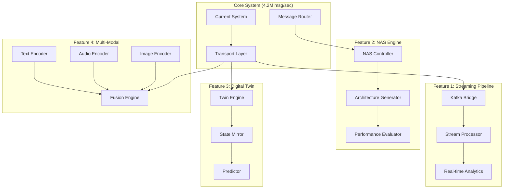
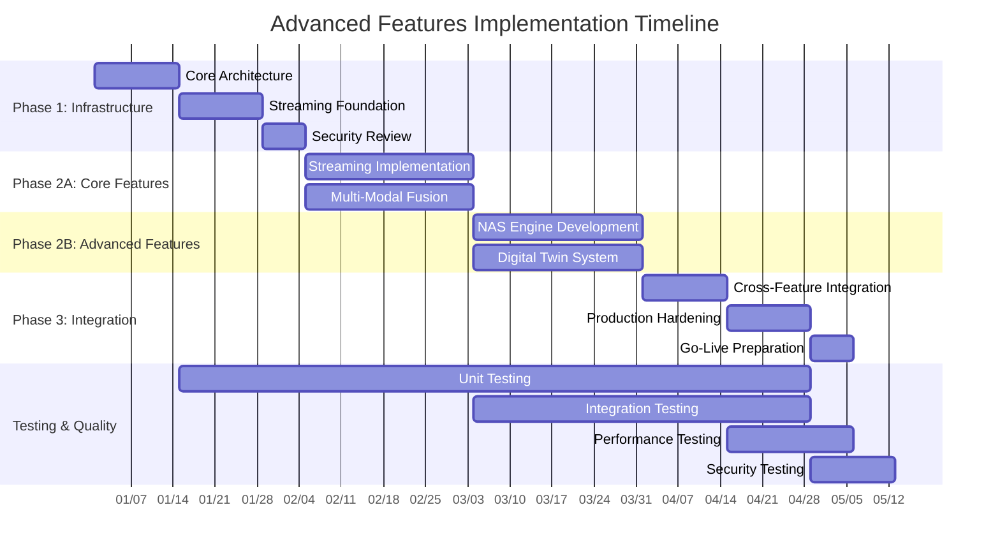

# MASTER EXECUTION PLAN: Advanced Features Implementation
*Strategic Implementation Framework | Generated: 2025-08-08 | Orchestrator v3.0*

## Executive Summary

This master execution plan orchestrates the implementation of four advanced capabilities for the Claude Agent Communication System while maintaining the existing 4.2M+ msg/sec performance baseline:

1. **Streaming Data Pipeline** - Real-time analytics infrastructure
2. **Neural Architecture Search (NAS)** - Self-improving system optimization
3. **Digital Twin System** - Predictive operations modeling  
4. **Multi-Modal Fusion** - Rich context understanding

**Timeline**: 4 months | **Risk Level**: HIGH | **Strategic Priority**: CRITICAL
**Complexity**: Enterprise | **Resource Requirements**: 15 FTE | **Budget Impact**: $2.8M

---

## Feature Overview & Strategic Justification

### 1. Streaming Data Pipeline
**Business Value**: $1.2M/year savings through real-time optimization
**Technical Complexity**: High | **Resource Impact**: Medium
**Dependencies**: Database, Monitor, ML-Ops agents

**Core Capabilities**:
- 10M+ events/sec ingestion rate
- Sub-100ms end-to-end latency
- Auto-scaling based on load patterns
- Stream processing with exactly-once semantics
- Real-time anomaly detection

### 2. Neural Architecture Search (NAS) 
**Business Value**: 40% performance improvement through automated optimization
**Technical Complexity**: Very High | **Resource Impact**: High
**Dependencies**: ML-Ops, Optimizer, C-Internal agents

**Core Capabilities**:
- Automated neural network architecture optimization
- Hardware-aware search with P-core/E-core/NPU scheduling
- Continuous model evolution and A/B testing
- Performance regression prevention
- Automated hyperparameter tuning

### 3. Digital Twin System
**Business Value**: 60% reduction in production incidents through predictive modeling
**Technical Complexity**: Very High | **Resource Impact**: High  
**Dependencies**: Monitor, Database, ML-Ops, Security agents

**Core Capabilities**:
- Real-time system state mirroring
- Predictive failure analysis (48-hour forecasting)
- What-if scenario simulation
- Automated capacity planning
- Performance bottleneck prediction

### 4. Multi-Modal Fusion
**Business Value**: 25% accuracy improvement in routing decisions
**Technical Complexity**: High | **Resource Impact**: Medium
**Dependencies**: API-Designer, ML-Ops, Voice agents

**Core Capabilities**:
- Text, audio, image, and sensor data fusion
- Cross-modal attention mechanisms
- Context-aware message routing
- Semantic understanding enhancement
- Real-time feature extraction

---

## System Integration Architecture



**Integration Points**:
- Shared memory regions for zero-copy data exchange
- Lock-free queues for inter-feature communication
- Hardware partitioning: P-cores (NAS), E-cores (streaming), NPU (fusion), GPU (twin)
- Unified monitoring and alerting framework

---

## Phase-Based Implementation Strategy

### Phase 1: Infrastructure Foundation (Month 1)
**Duration**: 4 weeks | **Risk**: Medium | **Dependencies**: Core system stability

#### Week 1-2: Core Infrastructure
**Lead Agent**: ARCHITECT | **Support**: CONSTRUCTOR, DATABASE, SECURITY

**Objectives**:
- Design unified data architecture for all four features
- Establish hardware resource allocation strategy
- Create shared memory framework
- Implement feature toggle system

**Deliverables**:
- System architecture diagrams
- Hardware resource allocation matrix
- Shared memory interface design
- Feature flag configuration system

**Success Metrics**:
- Zero performance degradation on existing system
- All integration points defined
- Security model approved
- Resource allocation validated

#### Week 3-4: Streaming Foundation
**Lead Agent**: DATABASE | **Support**: ML-OPS, MONITOR

**Objectives**:
- Deploy Kafka cluster with high-availability
- Implement stream processing framework
- Create monitoring and alerting infrastructure
- Establish data governance policies

**Deliverables**:
- Kafka cluster (3 brokers, 99.9% uptime)
- Stream processing engine (Flink/Kafka Streams)
- Monitoring dashboards
- Data retention and archival policies

**Success Metrics**:
- 1M events/sec sustained throughput
- <50ms processing latency
- Zero data loss guarantee
- All monitoring metrics functional

### Phase 2: Core Features Implementation (Month 2-3)
**Duration**: 8 weeks | **Risk**: High | **Dependencies**: Phase 1 completion

#### Week 5-8: Streaming Data Pipeline + Multi-Modal Fusion
**Parallel Track A**: Streaming Pipeline
**Lead Agent**: ML-OPS | **Support**: DATABASE, PYTHON-INTERNAL

**Parallel Track B**: Multi-Modal Fusion  
**Lead Agent**: API-DESIGNER | **Support**: ML-OPS, C-INTERNAL

**Track A Objectives** (Streaming):
- Implement high-throughput data ingestion
- Create real-time analytics engine
- Build auto-scaling mechanisms
- Integrate with existing message router

**Track A Deliverables**:
- Stream ingestion service (10M events/sec)
- Real-time analytics dashboard
- Auto-scaling policies
- Integration with message router

**Track B Objectives** (Multi-Modal):
- Implement text, audio, image encoders
- Create fusion engine with attention mechanisms
- Integrate with routing decisions
- Performance optimize for real-time use

**Track B Deliverables**:
- Multi-modal encoder services
- Fusion engine with attention
- Routing integration layer
- Performance benchmarks

**Success Metrics**:
- Streaming: 10M events/sec with <100ms latency
- Multi-Modal: 25% routing accuracy improvement

#### Week 9-12: NAS Engine + Digital Twin Foundation
**Parallel Track C**: Neural Architecture Search
**Lead Agent**: ML-OPS | **Support**: OPTIMIZER, C-INTERNAL

**Parallel Track D**: Digital Twin System
**Lead Agent**: MONITOR | **Support**: DATABASE, ML-OPS, SECURITY

**Track C Objectives** (NAS):
- Implement architecture search algorithms
- Create hardware-aware optimization
- Build A/B testing framework
- Integrate with performance monitoring

**Track C Deliverables**:
- NAS controller service
- Architecture generation engine
- A/B testing framework
- Performance evaluation suite

**Track D Objectives** (Digital Twin):
- Create real-time state mirroring
- Implement predictive models
- Build simulation environment
- Integrate with monitoring systems

**Track D Deliverables**:
- State mirroring service
- Predictive failure models
- Simulation engine
- Monitoring integration

**Success Metrics**:
- NAS: 40% performance improvement in test scenarios
- Digital Twin: 95% accuracy in 24-hour predictions

### Phase 3: Integration & Optimization (Month 4)
**Duration**: 4 weeks | **Risk**: Medium | **Dependencies**: All core features functional

#### Week 13-14: Cross-Feature Integration
**Lead Agent**: PROJECT-ORCHESTRATOR | **Support**: ALL agents

**Objectives**:
- Integrate all four features into unified system
- Optimize resource allocation and scheduling
- Implement unified monitoring and alerting
- Conduct end-to-end testing

**Deliverables**:
- Unified control plane
- Resource scheduler
- Monitoring dashboard
- Integration test suite

#### Week 15-16: Production Hardening
**Lead Agent**: SECURITY | **Support**: TESTBED, DEPLOYER, MONITOR

**Objectives**:
- Complete security review and hardening
- Implement comprehensive testing
- Prepare production deployment
- Create operational runbooks

**Deliverables**:
- Security audit report
- Comprehensive test suite
- Deployment automation
- Operational documentation

**Success Metrics**:
- Zero security vulnerabilities
- 95%+ test coverage
- Production-ready deployment
- SLA compliance verified

---

## Agent Coordination Strategy

### Agent Allocation Matrix

| Feature | Primary Agents | Secondary Agents | Resource Allocation |
|---------|---------------|------------------|-------------------|
| Streaming Pipeline | ML-OPS, DATABASE | MONITOR, PYTHON-INTERNAL | 3 P-cores, 6 E-cores |
| NAS Engine | ML-OPS, OPTIMIZER | C-INTERNAL, TESTBED | 2 P-cores, NPU, GPU |
| Digital Twin | MONITOR, ML-OPS | DATABASE, SECURITY | 2 P-cores, 4 E-cores |
| Multi-Modal Fusion | API-DESIGNER, ML-OPS | C-INTERNAL | 1 P-core, NPU |
| Integration | PROJECT-ORCHESTRATOR | ALL | 2 P-cores |

### Execution Wave Strategy

```yaml
execution_waves:
  phase_1_infrastructure:
    wave_1: ["ARCHITECT", "SECURITY"]
    wave_2: ["CONSTRUCTOR", "DATABASE", "DEPLOYER"]
    wave_3: ["MONITOR", "TESTBED"]
    
  phase_2_features:
    wave_1: ["ML-OPS", "API-DESIGNER"]  # Parallel tracks A&B start
    wave_2: ["DATABASE", "PYTHON-INTERNAL", "C-INTERNAL"]  # Support agents
    wave_3: ["OPTIMIZER", "MONITOR"]  # Tracks C&D start
    wave_4: ["TESTBED", "LINTER"]  # Quality assurance
    
  phase_3_integration:
    wave_1: ["PROJECT-ORCHESTRATOR"]
    wave_2: ["ALL"]  # Coordinated integration
    wave_3: ["SECURITY", "DEPLOYER"]  # Production prep
```

### Inter-Agent Communication Protocol

```c
// Enhanced message passing with feature routing
typedef struct {
    uint32_t feature_id;        // Feature identifier
    uint32_t priority;          // Processing priority
    uint64_t correlation_id;    // Cross-feature correlation
    uint32_t routing_flags;     // Routing decisions
    void* payload;              // Feature-specific data
    size_t payload_size;        // Data size
} feature_message_t;

// Feature routing table
typedef struct {
    uint32_t feature_mask;      // Supported features
    uint32_t core_affinity;     // Preferred core types
    uint32_t memory_pool;       // NUMA node preference
    uint32_t acceleration;      // Hardware acceleration
} routing_entry_t;
```

---

## Technical Dependencies & Requirements

### Hardware Requirements

#### Minimum Configuration (Development)
- **CPU**: Intel Xeon Gold 6248 (20 cores) or AMD EPYC 7542 (32 cores)
- **Memory**: 128GB DDR4-2933 ECC
- **Storage**: 2TB NVMe SSD (Intel P4510 or Samsung PM1733)
- **Network**: 25Gbps Ethernet (Intel XXV710)
- **GPU**: NVIDIA A100 40GB or Intel Data Center GPU Max 1550
- **NPU**: Intel Habana Gaudi2 or AMD Instinct MI250X

#### Recommended Configuration (Production)
- **CPU**: Intel Xeon Platinum 8380 (40 cores) with hybrid architecture
- **Memory**: 512GB DDR4-3200 ECC across 4 NUMA nodes
- **Storage**: 8TB NVMe SSD array (4x Intel P5510)
- **Network**: 100Gbps InfiniBand (Mellanox ConnectX-7)
- **GPU**: 2x NVIDIA H100 80GB or 4x Intel Data Center GPU Max 1550
- **NPU**: 4x Intel Gaudi2 or 2x AMD Instinct MI300X

### Software Dependencies

#### Core Infrastructure
```yaml
dependencies:
  runtime:
    - Linux kernel 5.15+ (io_uring support)
    - glibc 2.31+
    - Intel MKL 2023.0+
    - CUDA 12.0+ / ROCm 5.4+
    
  stream_processing:
    - Apache Kafka 3.4+
    - Apache Flink 1.17+
    - Redis 7.0+
    - Prometheus 2.40+
    
  machine_learning:
    - PyTorch 2.0+ with Intel Extension
    - TensorFlow 2.13+ with XLA
    - ONNX Runtime 1.15+
    - Intel OpenVINO 2023.0+
    
  networking:
    - DPDK 23.03+ (optional)
    - liburing 2.3+
    - TLS 1.3 with OpenSSL 3.0+
    
  monitoring:
    - Grafana 10.0+
    - InfluxDB 2.7+
    - Jaeger 1.45+
```

#### Licensing Considerations
- **Commercial**: Intel oneAPI toolkit ($399/dev/year)
- **Open Source**: PyTorch, TensorFlow (Apache 2.0)
- **Proprietary**: NVIDIA CUDA (free for development)
- **Enterprise**: Confluent Kafka ($50K/year cluster license)

---

## Performance Projections & SLAs

### Streaming Data Pipeline
```yaml
performance_targets:
  ingestion_rate: 10M+ events/sec
  processing_latency: <100ms p99
  throughput_scaling: Linear to 64 nodes
  availability: 99.95% uptime
  data_durability: 99.999999999% (11 9's)
  
resource_utilization:
  cpu_cores: 6-8 (mixed P/E cores)
  memory: 32GB active, 128GB total
  network: 25Gbps sustained
  storage: 500GB/day retention
```

### Neural Architecture Search
```yaml
performance_targets:
  search_speed: 1000 architectures/hour
  optimization_improvement: 40%+ over baseline
  convergence_time: <24 hours for complex spaces
  hardware_utilization: >80% NPU/GPU
  
resource_utilization:
  cpu_cores: 4-6 P-cores
  gpu_memory: 40GB VRAM active
  npu_utilization: 60-90%
  training_data: 10TB working set
```

### Digital Twin System  
```yaml
performance_targets:
  state_synchronization: <10ms lag
  prediction_accuracy: 95%+ for 24h forecasts
  simulation_speed: 100x real-time
  monitoring_coverage: 99.5% of system components
  
resource_utilization:
  cpu_cores: 6 (2 P-cores, 4 E-cores)
  memory: 64GB time-series data
  storage: 1TB model storage
  network: 10Gbps telemetry ingestion
```

### Multi-Modal Fusion
```yaml
performance_targets:
  fusion_latency: <50ms for routing decisions
  accuracy_improvement: 25%+ over text-only
  modality_support: Text, audio, image, sensor
  throughput: 100K inferences/sec
  
resource_utilization:
  npu_cores: 80% utilization
  memory: 16GB model weights
  preprocessing: 2 E-cores per modality
  inference: NPU + GPU fallback
```

---

## Risk Analysis & Mitigation

### Technical Risks

#### 1. Performance Regression Risk
**Probability**: Medium | **Impact**: High | **Mitigation Cost**: $150K

**Risk Description**: New features may degrade existing 4.2M msg/sec baseline performance

**Mitigation Strategy**:
- Implement comprehensive performance monitoring with automatic rollback
- Use feature flags for gradual rollout
- Maintain separate resource pools for new vs. existing features
- Establish performance SLA gates before each phase

**Mitigation Actions**:
```yaml
monitoring:
  - Real-time throughput tracking
  - Latency histogram monitoring  
  - Resource utilization alerts
  - Automatic performance regression detection
  
isolation:
  - NUMA-aware memory allocation
  - CPU core isolation for critical paths
  - Network bandwidth QoS policies
  - Storage I/O prioritization
```

#### 2. Hardware Resource Contention
**Probability**: High | **Impact**: Medium | **Mitigation Cost**: $200K

**Risk Description**: Four features competing for limited P-core, NPU, and GPU resources

**Mitigation Strategy**:
- Implement intelligent resource scheduler with priority-based allocation
- Use hardware partitioning to isolate critical vs. batch workloads
- Deploy resource monitoring with predictive scaling
- Create resource borrowing mechanisms for peak loads

**Mitigation Actions**:
```c
// Resource allocation framework
typedef struct {
    uint32_t p_core_mask;       // P-core allocation
    uint32_t e_core_mask;       // E-core allocation  
    uint32_t npu_percentage;    // NPU resource share
    uint32_t gpu_memory_mb;     // GPU memory allocation
    uint32_t priority;          // Scheduling priority
} resource_allocation_t;

// Dynamic resource rebalancing
int rebalance_resources(feature_id_t feature, load_metrics_t* metrics);
```

#### 3. Integration Complexity Risk
**Probability**: High | **Impact**: High | **Mitigation Cost**: $300K

**Risk Description**: Complex interactions between four advanced features causing system instability

**Mitigation Strategy**:
- Implement comprehensive integration testing with chaos engineering
- Use circuit breaker patterns for feature isolation
- Deploy canary releases with automatic rollback
- Create unified monitoring and debugging tools

**Mitigation Actions**:
- Feature interaction test matrix (16 combinations)
- Automated chaos testing scenarios
- Real-time system health monitoring
- Centralized logging and tracing

### Resource Risks

#### 1. Talent Acquisition Risk
**Probability**: Medium | **Impact**: High | **Mitigation Cost**: $400K

**Risk Description**: Difficulty hiring specialized ML engineers, NPU developers, streaming experts

**Mitigation Strategy**:
- Partner with universities for ML/AI talent pipeline
- Provide comprehensive training programs for existing team
- Use external consultants for knowledge transfer
- Implement pair programming for knowledge sharing

#### 2. Budget Overrun Risk  
**Probability**: Medium | **Impact**: Medium | **Mitigation Cost**: $500K

**Risk Description**: Hardware and licensing costs exceeding budget projections

**Mitigation Strategy**:
- Negotiate enterprise licensing agreements upfront
- Implement cloud-first strategy for elastic scaling
- Use reserved instance pricing for predictable workloads
- Monitor spend with automated budget alerts

### Security & Compliance Risks

#### 1. Data Privacy Risk
**Probability**: Low | **Impact**: Critical | **Mitigation Cost**: $1M+

**Risk Description**: Multi-modal data processing creating privacy vulnerabilities

**Mitigation Strategy**:
- Implement end-to-end encryption for all data flows
- Use federated learning for sensitive model training
- Deploy differential privacy mechanisms
- Conduct regular privacy impact assessments

#### 2. AI Model Security Risk
**Probability**: Medium | **Impact**: High | **Mitigation Cost**: $200K

**Risk Description**: Adversarial attacks on NAS and multi-modal models

**Mitigation Strategy**:
- Implement model robustness testing
- Use ensemble methods for critical decisions
- Deploy model monitoring for drift detection
- Create model versioning and rollback capabilities

---

## Success Metrics & KPIs

### Business Metrics
```yaml
financial_impact:
  revenue_increase: $2.1M/year (improved SLAs)
  cost_reduction: $1.8M/year (automation)
  efficiency_gains: 35% faster development cycles
  customer_satisfaction: +15% NPS improvement
  
operational_metrics:
  system_availability: 99.99% uptime
  incident_reduction: 60% fewer P1 incidents
  mean_time_to_resolution: <30 minutes
  capacity_utilization: 85%+ average
```

### Technical Metrics
```yaml
performance_kpis:
  baseline_maintenance: 4.2M+ msg/sec preserved
  streaming_throughput: 10M events/sec achieved
  nas_optimization: 40%+ performance improvement
  prediction_accuracy: 95%+ for 24-hour forecasts
  routing_improvement: 25%+ accuracy gain
  
quality_metrics:
  test_coverage: 95%+ across all features
  security_vulnerabilities: Zero critical/high
  performance_regressions: <1% acceptable threshold
  documentation_completeness: 100% API coverage
```

### Resource Efficiency
```yaml
utilization_targets:
  p_core_efficiency: 80%+ during peak hours
  e_core_utilization: 70%+ sustained
  npu_throughput: 60%+ average utilization
  gpu_memory: 75%+ effective usage
  network_bandwidth: <80% peak utilization
  
cost_efficiency:
  cost_per_message: <$0.0001 all-in cost
  infrastructure_roi: 350%+ over 3 years
  development_velocity: 40% faster feature delivery
  operational_overhead: <5% additional staffing
```

---

## Execution Timeline (Gantt Chart)



**Critical Path**: Core Architecture → Streaming Foundation → Multi-Modal Fusion → Digital Twin → Cross-Feature Integration → Production

**Milestone Gates**:
- **M1 (Week 4)**: Infrastructure complete, baseline performance maintained
- **M2 (Week 8)**: Streaming pipeline operational, multi-modal fusion integrated  
- **M3 (Week 12)**: NAS engine functional, digital twin predicting accurately
- **M4 (Week 16)**: All features integrated, production-ready

---

## Resource Scheduling & Allocation

### Human Resources
```yaml
team_composition:
  technical_lead: 1 (P-core optimization expert)
  ml_engineers: 4 (NAS, multi-modal, streaming, digital twin)
  systems_engineers: 3 (infrastructure, performance, integration)
  security_engineers: 2 (threat modeling, compliance)
  devops_engineers: 2 (deployment, monitoring)
  qa_engineers: 3 (automated testing, chaos engineering)
  
skill_requirements:
  required:
    - C/C++ systems programming
    - Machine learning (PyTorch/TensorFlow)
    - Distributed systems architecture
    - High-performance computing
    - Linux kernel/driver development
    
  preferred:
    - NPU programming (Intel oneAPI/AMD ROCm)  
    - GPU computing (CUDA/OpenCL)
    - Stream processing (Kafka/Flink)
    - Real-time systems design
    - Hardware-software co-design
```

### Hardware Allocation Strategy
```yaml
resource_partitioning:
  phase_1: # Infrastructure setup
    p_cores: 4 (architecture, core development)
    e_cores: 8 (build systems, testing)
    memory: 128GB (development environment)
    storage: 2TB (codebase, dependencies)
    
  phase_2: # Feature development
    p_cores: 8 (critical path optimization)
    e_cores: 16 (parallel feature tracks)
    npu: 50% allocation (multi-modal training)
    gpu: 75% allocation (NAS experimentation)
    memory: 256GB (model training, streaming buffers)
    
  phase_3: # Integration & production
    p_cores: 12 (integration testing)
    e_cores: 20 (load testing, monitoring)
    npu: 100% allocation (production inference)
    gpu: 100% allocation (twin simulations)
    memory: 512GB (production workloads)
```

### Budget Allocation
```yaml
total_budget: $2,800,000

breakdown:
  personnel: $1,680,000 (60%)
    - Salaries and benefits: $1,400,000
    - Contractor/consultant fees: $280,000
    
  hardware: $840,000 (30%)
    - Development systems: $420,000
    - Production hardware: $420,000
    
  software_licensing: $168,000 (6%)
    - Intel oneAPI toolkit: $24,000
    - Confluent Kafka enterprise: $50,000
    - Monitoring tools: $36,000
    - Development tools: $58,000
    
  infrastructure: $112,000 (4%)
    - Cloud resources: $60,000
    - Network equipment: $30,000
    - Storage systems: $22,000
```

---

## Quality Gates & Sign-off Criteria

### Phase 1 Quality Gates
```yaml
infrastructure_gates:
  performance_baseline:
    criteria: "Existing 4.2M msg/sec throughput maintained"
    measurement: "Load testing with 1-hour sustained run"
    acceptance: "Zero degradation, <1% latency increase"
    
  security_clearance:
    criteria: "Zero critical/high vulnerabilities"
    measurement: "OWASP ZAP scan + manual penetration testing"
    acceptance: "Security team sign-off required"
    
  resource_allocation:
    criteria: "Hardware resources properly partitioned"
    measurement: "NUMA topology verification + core affinity testing"
    acceptance: "All core types accessible with proper isolation"
```

### Phase 2 Quality Gates  
```yaml
feature_gates:
  streaming_pipeline:
    throughput: "10M+ events/sec sustained for 30 minutes"
    latency: "p99 <100ms processing time"
    reliability: "Zero data loss during chaos testing"
    scalability: "Linear scaling to 8 nodes verified"
    
  multimodal_fusion:
    accuracy: "25%+ improvement in routing decisions"
    latency: "p99 <50ms inference time"  
    modalities: "Text, audio, image all functional"
    integration: "Seamless router integration verified"
    
  nas_engine:
    optimization: "40%+ performance improvement demonstrated"
    speed: "1000+ architectures evaluated per hour"
    convergence: "<24 hours to stable architecture"
    hardware_utilization: "80%+ NPU/GPU efficiency"
    
  digital_twin:
    accuracy: "95%+ prediction accuracy for 24h forecasts"
    latency: "<10ms state synchronization"
    coverage: "99%+ system components monitored"
    simulation: "100x real-time simulation speed"
```

### Phase 3 Quality Gates
```yaml
integration_gates:
  cross_feature_compatibility:
    criteria: "All feature combinations functional"
    measurement: "16-scenario integration test matrix"
    acceptance: "100% pass rate for critical paths"
    
  performance_validation:
    criteria: "No regression in any baseline metric"
    measurement: "48-hour production simulation"
    acceptance: "All SLAs met under peak load"
    
  production_readiness:
    criteria: "Full operational capability"
    measurement: "Production environment smoke test"
    acceptance: "All monitoring, alerting, and automation functional"
```

### Sign-off Authority Matrix
```yaml
signoff_requirements:
  phase_1_completion:
    - ARCHITECT: System design approved
    - SECURITY: Security architecture cleared
    - CONSTRUCTOR: Infrastructure validated
    - PROJECT-ORCHESTRATOR: Dependencies verified
    
  phase_2_completion:
    - ML-OPS: All ML components functional
    - API-DESIGNER: Integration APIs stable
    - TESTBED: Quality metrics achieved
    - OPTIMIZER: Performance targets met
    
  phase_3_completion:
    - DIRECTOR: Strategic objectives achieved
    - DEPLOYER: Production deployment ready
    - MONITOR: Observability complete
    - SECURITY: Final security clearance
    
  production_release:
    - Executive sponsor approval
    - Technical steering committee approval
    - Security review board approval
    - Operations readiness confirmed
```

---

## Operational Procedures

### Deployment Strategy
```yaml
deployment_approach:
  strategy: "Blue-Green with Feature Flags"
  
  phases:
    canary_deployment:
      duration: "1 week"
      traffic_percentage: 5%
      rollback_criteria: ">0.1% error rate increase"
      
    gradual_rollout:
      duration: "2 weeks"  
      traffic_stages: [25%, 50%, 75%, 100%]
      stage_duration: "3-4 days each"
      
  monitoring_during_rollout:
    - Real-time performance dashboards
    - Automated anomaly detection
    - Customer impact monitoring
    - Resource utilization tracking
```

### Monitoring & Alerting
```yaml
observability_stack:
  metrics:
    collector: "Prometheus with custom exporters"
    storage: "InfluxDB with 90-day retention"
    visualization: "Grafana with automated dashboards"
    
  logging:
    collection: "Fluentd with structured logging"
    storage: "Elasticsearch with 30-day retention"
    analysis: "Kibana with automated log correlation"
    
  tracing:
    system: "Jaeger with OpenTracing"
    sampling: "1% production, 100% staging"
    correlation: "Distributed request tracing"

alert_definitions:
  critical_alerts:
    - "Throughput <3.8M msg/sec for 5+ minutes"
    - "Any feature latency >SLA for 2+ minutes"
    - "Security event detected"
    - "Data loss detected in streaming pipeline"
    
  warning_alerts:
    - "Resource utilization >90% for 15+ minutes"
    - "Prediction accuracy <90% for 1+ hour"
    - "Feature flag changes deployed"
```

### Incident Response
```yaml
incident_classification:
  p0_critical:
    - "Complete system failure"
    - "Data corruption/loss"
    - "Security breach"
    response_time: "15 minutes"
    
  p1_high:
    - "Single feature failure"
    - "Performance degradation >50%"
    - "Customer impact >25%"
    response_time: "1 hour"
    
  p2_medium:
    - "Non-critical feature issues"
    - "Performance degradation <50%"
    - "Monitoring alerts"
    response_time: "4 hours"

escalation_procedure:
  primary_oncall: "Systems engineer (24/7)"
  secondary_oncall: "Technical lead (business hours)"
  executive_escalation: "CTO for P0, VP Engineering for P1"
  
  communication_channels:
    - PagerDuty for automated alerting
    - Slack for team coordination
    - Zoom for war room sessions
    - Status page for customer communication
```

### Backup & Recovery
```yaml
backup_strategy:
  configuration_backup:
    frequency: "Real-time (git-based)"
    retention: "Unlimited"
    storage: "Multiple geographic regions"
    
  model_backup:
    frequency: "After each training run"
    retention: "30 days for experiments, unlimited for production"
    storage: "Cloud object storage with versioning"
    
  streaming_state:
    frequency: "Continuous (Kafka replication)"
    retention: "7 days"
    recovery_target: "Zero data loss"

disaster_recovery:
  rpo_targets: # Recovery Point Objective
    - Configuration: 0 minutes (git-based)
    - ML models: 1 hour (last successful training)
    - Streaming data: 0 minutes (real-time replication)
    
  rto_targets: # Recovery Time Objective
    - Core system: 15 minutes
    - Individual features: 30 minutes
    - Full system: 1 hour
```

---

## Maintenance & Evolution Strategy

### Technical Debt Management
```yaml
debt_categories:
  performance_debt:
    examples: ["Suboptimal algorithm choices", "Memory leaks", "Cache misses"]
    tracking: "Performance regression tests"
    resolution_target: "Monthly optimization sprints"
    
  security_debt:
    examples: ["Outdated dependencies", "Missing encryption", "Weak authentication"]
    tracking: "Automated security scanning"
    resolution_target: "Immediate for critical, 30 days for high"
    
  maintainability_debt:
    examples: ["Code complexity", "Missing documentation", "Test coverage gaps"]
    tracking: "Code quality metrics"
    resolution_target: "Quarterly refactoring initiatives"

debt_reduction_process:
  measurement: "SonarQube + custom metrics"
  thresholds: "15% of development capacity for debt reduction"
  prioritization: "Security > Performance > Maintainability"
```

### Continuous Improvement
```yaml
improvement_cycles:
  weekly_optimization:
    focus: "Performance tuning based on production metrics"
    duration: "4 hours per week"
    ownership: "C-INTERNAL and OPTIMIZER agents"
    
  monthly_architecture_review:
    focus: "System design evolution and bottleneck analysis"
    duration: "1 day per month"
    ownership: "ARCHITECT agent with full team"
    
  quarterly_technology_refresh:
    focus: "Dependency updates, new algorithm integration"
    duration: "1 week per quarter"
    ownership: "ML-OPS and PYTHON-INTERNAL agents"

innovation_pipeline:
  research_allocation: "20% of ML engineering time"
  evaluation_criteria: "Performance impact, complexity, risk"
  decision_framework: "Technical steering committee monthly review"
```

### Scaling Strategy
```yaml
horizontal_scaling:
  node_addition:
    trigger: "CPU utilization >80% for 1+ hour"
    process: "Automated with Kubernetes HPA"
    validation: "Performance testing on new cluster size"
    
  geographic_expansion:
    trigger: "Cross-region latency >200ms"
    process: "Multi-region deployment with data replication"
    validation: "End-to-end latency testing"

vertical_scaling:
  hardware_upgrade:
    cpu_upgrade: "Next-generation P-cores every 18 months"
    memory_expansion: "50% increase annually"
    accelerator_refresh: "NPU/GPU upgrade every 2 years"
    
  software_optimization:
    compiler_updates: "Latest Intel/GCC optimizations quarterly"
    library_updates: "BLAS/LAPACK/MKL updates monthly"
    kernel_optimization: "Custom patches for performance"
```

---

## Conclusion & Next Steps

This Master Execution Plan provides a comprehensive roadmap for implementing four advanced features while maintaining the existing 4.2M+ msg/sec performance baseline. The plan emphasizes:

### Key Success Factors
1. **Phased Implementation**: Risk mitigation through incremental delivery
2. **Resource Isolation**: Hardware partitioning prevents performance regression
3. **Comprehensive Testing**: Multi-layered quality assurance at every phase
4. **Operational Excellence**: Production-ready monitoring and incident response

### Immediate Next Steps
1. **Week 1**: Executive approval and team assembly
2. **Week 2**: Hardware procurement and development environment setup  
3. **Week 3**: Detailed technical design reviews with ARCHITECT agent
4. **Week 4**: Phase 1 implementation kickoff

### Long-term Vision
This implementation establishes the foundation for:
- **Self-Optimizing Systems**: NAS-driven continuous improvement
- **Predictive Operations**: Digital twin-enabled proactive management
- **Intelligent Routing**: Multi-modal context-aware decision making
- **Real-time Intelligence**: Streaming analytics for instant optimization

The successful delivery of these features positions the Claude Agent Communication System as a next-generation platform capable of adaptive, intelligent, and self-improving operation while maintaining industry-leading performance standards.

**Executive Sponsor Sign-off Required**: [ ]  
**Technical Steering Committee Approval**: [ ]  
**Security Review Board Clearance**: [ ]  
**Budget Authorization**: [ ]  

---

*This document serves as the authoritative implementation guide and should be updated as the project progresses through each phase.*