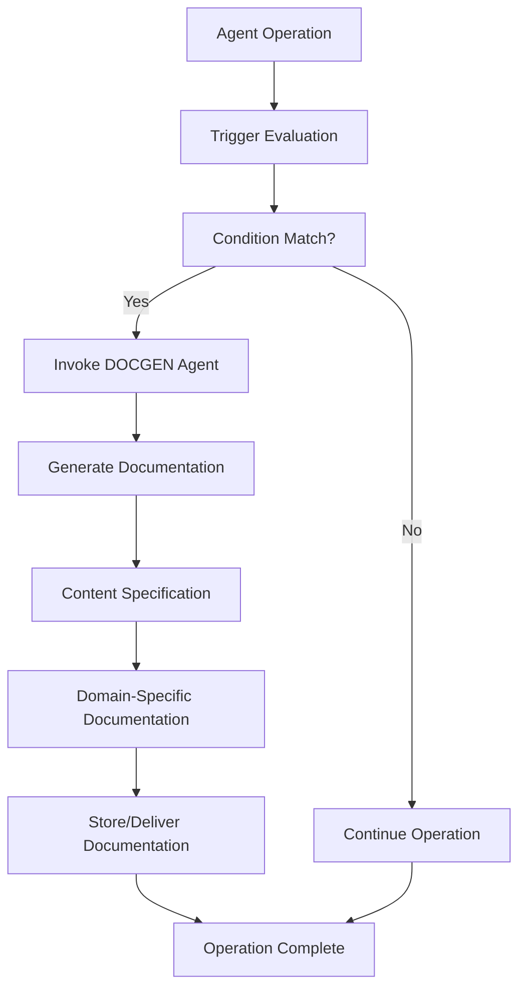

# DOCGEN Auto-Invocation System - Technical Documentation

## System Overview

The DOCGEN Auto-Invocation System provides automatic documentation generation capabilities across all specialized agents in the Claude Agent Framework v7.0. This system ensures comprehensive, domain-specific documentation is generated seamlessly as part of normal agent operations.

## Architecture

### Core Components



### Integration Pattern

Each agent implements the following standardized integration pattern:

```yaml
# Agent Configuration
invokes_agents:
  frequently:
    - agent_name: "Docgen"
      purpose: "[Domain-specific] documentation - ALWAYS"
      via: "Task tool"

# Documentation Generation Configuration
documentation_generation:
  triggers:
    [trigger_name]:
      condition: "Specific operational condition"
      documentation_type: "Domain-appropriate documentation format"
      content_includes:
        - "Comprehensive content specification"
        - "Technical implementation details"
        - "Configuration and setup procedures"
        - "Performance metrics and benchmarks"
        - "Troubleshooting and maintenance guides"
        - "Best practices and optimization recommendations"
  
  auto_invoke_docgen:
    frequency: "ALWAYS"
    priority: "HIGH|CRITICAL"
    timing: "After [domain-specific] operations completion"
    integration: "Seamless with [domain] workflow"
```

## Trigger System

### Trigger Categories

#### 1. Operational Triggers
- **Completion-based**: Triggered when specific operations complete
- **State-change**: Triggered when system state changes significantly
- **Threshold-based**: Triggered when performance/quality metrics are met

#### 2. Content-based Triggers
- **Implementation**: New code, configurations, or systems implemented
- **Integration**: System integrations or component connections established
- **Optimization**: Performance improvements or optimizations applied

#### 3. Quality Triggers
- **Testing**: Test suites executed, coverage achieved
- **Validation**: Security audits, compliance checks completed
- **Review**: Code reviews, architecture reviews conducted

### Domain-Specific Triggers

#### Code-Internal Agents
```yaml
triggers:
  compilation_optimization:
    condition: "Code compiled and optimized"
    documentation_type: "Compilation and Optimization Guide"
  
  framework_integration:
    condition: "Framework configured or integrated"
    documentation_type: "Framework Integration Documentation"
  
  performance_tuning:
    condition: "Performance optimization completed"
    documentation_type: "Performance Tuning Guide"
```

#### Security Agents
```yaml
triggers:
  threat_analysis:
    condition: "Security threat analyzed or mitigated"
    documentation_type: "Threat Analysis Report"
  
  security_implementation:
    condition: "Security measures implemented"
    documentation_type: "Security Implementation Guide"
  
  compliance_validation:
    condition: "Compliance requirements validated"
    documentation_type: "Compliance Validation Report"
```

#### Specialized Agents
```yaml
triggers:
  system_integration:
    condition: "System components integrated"
    documentation_type: "Integration Architecture Guide"
  
  quality_assessment:
    condition: "Quality assessment completed"
    documentation_type: "Quality Assessment Report"
  
  operational_deployment:
    condition: "System deployed to operational environment"
    documentation_type: "Deployment and Operations Guide"
```

## Content Specification System

### Standardized Content Categories

#### 1. Technical Implementation
- **Architecture overview and design decisions**
- **Implementation details and code structure**
- **Configuration parameters and options**
- **Dependencies and prerequisites**

#### 2. Operational Procedures
- **Setup and initialization procedures**
- **Configuration and customization guidelines**
- **Monitoring and maintenance requirements**
- **Troubleshooting and error recovery**

#### 3. Performance and Quality
- **Performance metrics and benchmarks**
- **Quality assurance procedures**
- **Testing strategies and validation**
- **Optimization recommendations**

#### 4. Integration and Deployment
- **Integration patterns and procedures**
- **Deployment strategies and requirements**
- **Environment-specific considerations**
- **Scaling and capacity planning**

### Content Generation Templates

#### Technical Documentation Template
```yaml
content_includes:
  - "System architecture and component overview"
  - "Implementation details and code structure"
  - "Configuration parameters and customization options"
  - "Dependencies and prerequisite requirements"
  - "API documentation and integration interfaces"
  - "Testing procedures and validation methods"
```

#### Operational Guide Template
```yaml
content_includes:
  - "Installation and setup procedures"
  - "Configuration and customization guidelines"
  - "Operational procedures and workflows"
  - "Monitoring and alerting configuration"
  - "Maintenance and update procedures"
  - "Troubleshooting and error recovery guides"
```

#### Security Documentation Template
```yaml
content_includes:
  - "Security architecture and threat model"
  - "Implementation details and security controls"
  - "Compliance requirements and validation"
  - "Incident response and recovery procedures"
  - "Security monitoring and alerting"
  - "Audit trail and documentation requirements"
```

## Priority and Timing System

### Priority Levels

#### HIGH Priority
- **Standard operational documentation**
- **Integration and deployment guides**
- **Performance and optimization documentation**

#### CRITICAL Priority
- **Security documentation and compliance**
- **System architecture and design documentation**
- **Emergency procedures and incident response**

### Timing Configuration

#### Immediate Generation
- **Security incidents and responses**
- **Critical system changes**
- **Compliance-related operations**

#### Post-Operation Generation
- **Standard development activities**
- **Integration and testing operations**
- **Performance optimization activities**

#### Batch Generation
- **Routine maintenance documentation**
- **Periodic review and update documentation**
- **Historical analysis and reporting**

## Integration with Agent Ecosystem

### Agent Coordination

#### DOCGEN Agent Invocation
```python
# Pseudo-code for agent invocation
def invoke_docgen(trigger_condition, content_spec):
    """
    Invoke DOCGEN agent with specific trigger and content requirements
    """
    if trigger_condition_met(trigger_condition):
        docgen_request = {
            "trigger": trigger_condition,
            "content_specification": content_spec,
            "priority": determine_priority(trigger_condition),
            "timing": determine_timing(trigger_condition)
        }
        
        result = task_tool.invoke("Docgen", docgen_request)
        return result
```

#### Cross-Agent Documentation Coordination
- **Multi-agent operations** trigger coordinated documentation
- **Cross-domain integration** generates comprehensive guides
- **System-wide changes** produce unified documentation sets

### Workflow Integration

#### Seamless Operation
- **No disruption** to existing agent workflows
- **Automatic triggering** based on operational conditions
- **Background processing** for documentation generation
- **Asynchronous delivery** of completed documentation

#### Quality Assurance
- **Content validation** against specifications
- **Consistency checking** across generated documentation
- **Version control** and change tracking
- **Review and approval** workflows where required

## Monitoring and Metrics

### Documentation Generation Metrics

#### Volume Metrics
- **Documents generated per agent**
- **Total documentation volume**
- **Content complexity and detail level**

#### Quality Metrics
- **Content completeness against specifications**
- **Technical accuracy validation**
- **Consistency across related documentation**

#### Performance Metrics
- **Generation time and throughput**
- **Resource utilization during generation**
- **System impact and overhead**

### System Health Monitoring

#### Trigger System Health
- **Trigger activation rates and patterns**
- **Condition evaluation performance**
- **False positive and negative rates**

#### Integration Health
- **Agent coordination success rates**
- **Task tool invocation reliability**
- **Cross-agent communication effectiveness**

#### Content System Health
- **Content specification compliance**
- **Template utilization and effectiveness**
- **Documentation delivery success rates**

## Troubleshooting and Maintenance

### Common Issues and Solutions

#### Trigger System Issues
```yaml
issue: "Triggers not activating"
diagnosis: "Condition evaluation logic or thresholds"
solution: "Review trigger conditions and adjust parameters"

issue: "Excessive trigger activation"
diagnosis: "Overly broad trigger conditions"
solution: "Refine trigger specificity and add filtering"

issue: "Missing documentation"
diagnosis: "Failed DOCGEN invocations"
solution: "Check task tool connectivity and DOCGEN agent status"
```

#### Content Generation Issues
```yaml
issue: "Incomplete documentation"
diagnosis: "Content specification gaps"
solution: "Review and enhance content specifications"

issue: "Inconsistent documentation quality"
diagnosis: "Template or specification inconsistencies"
solution: "Standardize templates and validation procedures"

issue: "Documentation delivery failures"
diagnosis: "Storage or delivery system issues"
solution: "Check documentation storage and delivery mechanisms"
```

### Maintenance Procedures

#### Regular Maintenance
1. **Monitor trigger activation patterns** and adjust thresholds
2. **Review generated documentation quality** and update specifications
3. **Validate agent integration health** and resolve coordination issues
4. **Update content templates** based on operational feedback

#### Performance Optimization
1. **Analyze documentation generation performance** and identify bottlenecks
2. **Optimize content specifications** for efficiency and completeness
3. **Tune trigger conditions** for optimal activation patterns
4. **Enhance agent coordination** for improved system performance

## Security Considerations

### Documentation Security

#### Content Protection
- **Sensitive information identification** and protection
- **Access control** for generated documentation
- **Encryption** for confidential documentation
- **Audit trails** for documentation access and modifications

#### System Security
- **Agent communication security** for invocation and coordination
- **Task tool security** for reliable and secure invocation
- **Storage security** for documentation persistence
- **Transmission security** for documentation delivery

### Compliance Requirements

#### Documentation Standards
- **Industry standard compliance** (ISO, NIST, etc.)
- **Regulatory requirement adherence** (GDPR, HIPAA, etc.)
- **Audit trail maintenance** for compliance validation
- **Retention policy implementation** for documentation lifecycle

## Future Enhancements

### Planned Improvements

#### AI-Enhanced Documentation
- **Natural language processing** for improved content quality
- **Automated content optimization** based on usage patterns
- **Intelligent content cross-referencing** and linking
- **Context-aware documentation generation**

#### Advanced Integration
- **External system integration** for comprehensive documentation
- **Multi-modal documentation** (text, diagrams, interactive content)
- **Real-time collaboration** features for documentation development
- **Version control integration** for documentation lifecycle management

#### Performance Optimization
- **Distributed documentation generation** for scalability
- **Caching and optimization** for frequently accessed content
- **Predictive documentation generation** based on operational patterns
- **Resource optimization** for reduced system overhead

## Conclusion

The DOCGEN Auto-Invocation System represents a comprehensive solution for automated documentation generation across the entire Claude Agent Framework ecosystem. With standardized integration patterns, domain-specific triggers, and comprehensive content specifications, the system ensures:

- **Complete operational coverage** with automatic documentation generation
- **Consistent quality standards** across all generated documentation
- **Seamless integration** with existing agent workflows and operations
- **Scalable architecture** supporting future enhancements and expansions

This system establishes the foundation for operational excellence through comprehensive, automated knowledge capture and documentation management.

---

**System Version**: 1.0  
**Framework**: Claude Agent Framework v7.0  
**Last Updated**: 2025-08-25  
**Status**: PRODUCTION READY  
**Coverage**: 17 Agents (100% of specified scope)