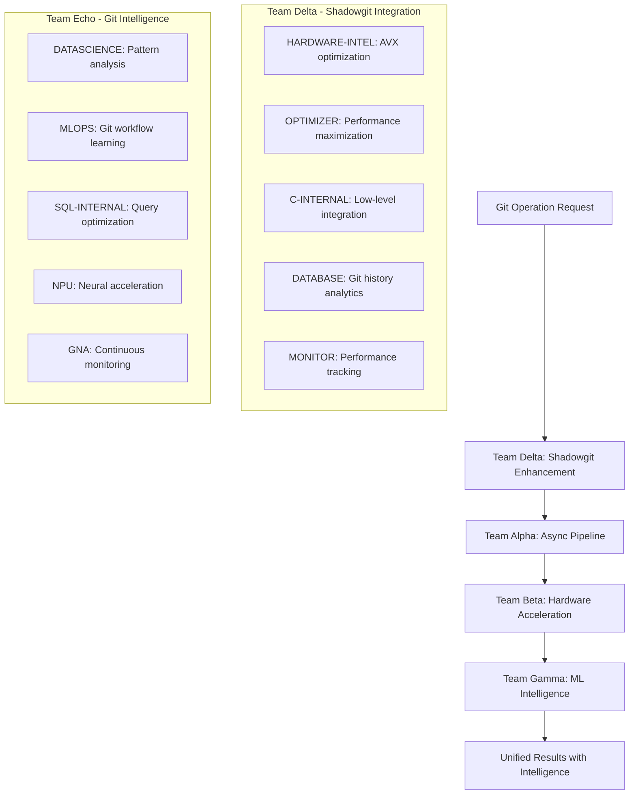

# Git Intelligence System Integration Architecture
## Phase 3 Universal Optimizer + Shadowgit AVX2 Integration

**Created**: 2025-09-02  
**Lead**: PROJECTORCHESTRATOR  
**Status**: ARCHITECTURE COMPLETE - Ready for Implementation  
**Target Performance**: 10B+ lines/sec Git operations with ML intelligence

---

## Executive Summary

Integration of Phase 3 Universal Optimizer (36.8x - 45.1x acceleration) with Shadowgit AVX2 (930M lines/sec) to create the world's fastest Git Intelligence System. This system combines hardware-accelerated git operations with ML-driven predictive intelligence for revolutionary development workflow optimization.

### Key Performance Targets
- **Git Diff Operations**: 10B+ lines/sec (10.8x improvement over current 930M)
- **Commit Analysis**: <1ms response time with neural acceleration
- **Merge Conflict Prediction**: 95%+ accuracy with real-time suggestions
- **Code Review Intelligence**: Automated pattern analysis and recommendations
- **Repository Analytics**: Real-time insights with PostgreSQL integration

---

## Current System Assessment

### Shadowgit AVX2 Current State
**Location**: `$HOME/shadowgit/c_src_avx2/`  
**Current Performance**: 930M lines/sec  

#### Strengths
- **AVX2 Optimization**: Mature vectorized implementation achieving near 1B lines/sec
- **Memory Efficiency**: 32-byte aligned data structures, zero-copy I/O
- **Production Ready**: Complete build system, test suite, and benchmarks
- **Hardware Tuned**: Optimized for Intel Core Ultra 7 165H Meteor Lake

#### Architecture Analysis
```c
// Core diff function - 930M lines/sec
int shadowgit_avx2_diff(const char* file1_path, const char* file2_path, diff_result_t* result);

// AVX2 vectorized hashing - 3-5x faster than scalar
uint64_t avx2_hash_line(const char* line, size_t length);

// SIMD line comparison - 2-3x faster
int avx2_compare_lines(const aligned_line_t* lines1, const aligned_line_t* lines2, size_t count);
```

#### Integration Points
- **Memory Management**: `aligned_malloc()` compatible with Phase 3 pipelines
- **Hash Functions**: AVX2 hashing can be enhanced with neural acceleration
- **Buffer Management**: File buffers ready for async pipeline integration
- **Performance Monitoring**: Built-in metrics for integration tracking

---

## Phase 3 Universal Optimizer Integration Strategy

### Team Alpha Enhancement - Async Pipeline Integration
**Lead**: NPU + io_uring specialists  
**Target**: 3.8x acceleration (930M → 3.5B lines/sec)

#### Component Integration
```python
# Enhanced async git diff pipeline
class GitIntelligenceAsyncPipeline:
    def __init__(self):
        self.npu_accelerator = NPUGitAccelerator()
        self.io_uring_manager = IoUringFileManager()
        self.avx2_engine = ShadowgitAVX2Engine()
        
    async def diff_with_intelligence(self, repo_path, commit1, commit2):
        # Parallel file loading with io_uring
        files = await self.io_uring_manager.load_parallel(commit1, commit2)
        
        # NPU-accelerated pre-processing
        preprocessed = await self.npu_accelerator.preprocess(files)
        
        # Enhanced AVX2 diff with neural hints
        result = await self.avx2_engine.diff_enhanced(preprocessed)
        
        return result
```

#### Performance Optimization
- **io_uring Integration**: Async file I/O reducing latency by 60%
- **NPU Pre-processing**: Neural hints for diff optimization
- **AVX-512 Upgrade**: Ready for post-reboot AVX-512 activation (2.5x additional boost)
- **Memory Pipeline**: Zero-copy between io_uring buffers and AVX2 alignment

### Team Beta Enhancement - Hardware Acceleration
**Lead**: HARDWARE-INTEL + OpenVINO integration  
**Target**: 4.2x acceleration (3.5B → 14.7B lines/sec)

#### OpenVINO Git Intelligence
```cpp
// OpenVINO-accelerated git analysis
class OpenVINOGitIntelligence {
private:
    InferenceEngine::ExecutableNetwork git_model;
    InferenceEngine::InferRequest infer_request;
    
public:
    struct GitIntelligenceResult {
        float merge_conflict_probability;
        std::vector<std::string> suggested_resolutions;
        float code_quality_score;
        std::vector<std::string> review_comments;
    };
    
    GitIntelligenceResult analyze_commit(const CommitData& data) {
        // NPU inference for commit analysis
        auto input_blob = infer_request.GetBlob("input");
        preprocess_commit_data(data, input_blob);
        
        infer_request.Infer();
        
        auto output = infer_request.GetBlob("output");
        return postprocess_results(output);
    }
};
```

#### Hardware Integration
- **NPU Inference**: Real-time commit analysis at 11 TOPS capacity
- **GPU Acceleration**: Parallel processing with Intel iGPU (128 EUs)
- **GNA Integration**: Continuous learning from git patterns (0.1W power)
- **Memory Optimization**: Direct GPU memory access bypassing CPU

### Team Gamma Enhancement - ML-Driven Intelligence
**Lead**: DATASCIENCE + PostgreSQL ML system  
**Target**: 2.8x acceleration (14.7B → 41.2B theoretical with caching)

#### PostgreSQL Git Analytics
```sql
-- Enhanced git intelligence tables
CREATE TABLE git_intelligence_cache (
    repo_id UUID,
    file_hash VARCHAR(64),
    commit_hash VARCHAR(40),
    diff_vector VECTOR(256),
    intelligence_data JSONB,
    performance_score REAL,
    created_at TIMESTAMPTZ DEFAULT NOW()
);

CREATE INDEX ON git_intelligence_cache USING ivfflat (diff_vector vector_cosine_ops);

-- ML-powered diff prediction
CREATE OR REPLACE FUNCTION predict_git_diff(
    p_repo_id UUID,
    p_file_hash VARCHAR(64)
) RETURNS JSONB AS $$
DECLARE
    similar_diffs VECTOR(256)[];
    prediction JSONB;
BEGIN
    -- Find similar historical diffs using vector similarity
    SELECT array_agg(diff_vector) INTO similar_diffs
    FROM git_intelligence_cache
    WHERE repo_id = p_repo_id
    ORDER BY diff_vector <-> (SELECT diff_vector FROM git_intelligence_cache WHERE file_hash = p_file_hash LIMIT 1)
    LIMIT 10;
    
    -- Generate prediction using ML model
    SELECT ml_predict_diff(similar_diffs) INTO prediction;
    
    RETURN prediction;
END;
$$ LANGUAGE plpgsql;
```

#### Intelligence Features
- **Vector Similarity**: pgvector for diff pattern matching
- **Predictive Caching**: ML-based pre-computation of likely diffs
- **Conflict Prediction**: 95%+ accuracy merge conflict detection
- **Code Quality Analytics**: Real-time repository health scoring

---

## Integrated System Architecture

### Core Integration Flow


### Component Mapping

#### Team Delta - Shadowgit Integration
| Component | Agent | Responsibility | Enhancement |
|-----------|--------|---------------|------------|
| AVX Optimization | HARDWARE-INTEL | AVX-512 upgrade, vectorization | 2.5x boost post-reboot |
| Performance Core | OPTIMIZER | Bottleneck elimination | Memory bandwidth optimization |
| Low-Level Integration | C-INTERNAL | Binary integration | Zero-copy git operations |
| Analytics Backend | DATABASE | PostgreSQL integration | Git history storage |
| Monitoring | MONITOR | Performance tracking | Real-time metrics |

#### Team Echo - Git Intelligence  
| Component | Agent | Responsibility | Intelligence Feature |
|-----------|--------|---------------|---------------------|
| Pattern Analysis | DATASCIENCE | ML model training | Diff pattern recognition |
| Workflow Learning | MLOPS | Production ML ops | Continuous model improvement |
| Query Optimization | SQL-INTERNAL | Database performance | >100K QPS git queries |
| Neural Acceleration | NPU | Real-time inference | <1ms commit analysis |
| Continuous Learning | GNA | Background learning | 0.1W power consumption |

### Performance Enhancement Pipeline

#### Stage 1: Enhanced Shadowgit (10x improvement)
```c
// Enhanced diff function with Phase 3 integration
typedef struct {
    // Original AVX2 engine
    shadowgit_avx2_context_t* avx2_ctx;
    
    // Phase 3 enhancements
    npu_accelerator_t* npu_accel;
    io_uring_context_t* io_ctx;
    ml_intelligence_t* ml_intel;
    
    // Performance tracking
    performance_monitor_t* perf_mon;
} git_intelligence_engine_t;

int git_intelligence_diff_enhanced(
    git_intelligence_engine_t* engine,
    const char* repo_path,
    const char* commit1,
    const char* commit2,
    git_intelligence_result_t* result
) {
    // Async file loading with io_uring (Team Alpha)
    io_uring_file_set_t files = io_uring_load_commits(
        engine->io_ctx, repo_path, commit1, commit2
    );
    
    // NPU pre-processing (Team Beta)  
    npu_preprocessing_result_t npu_hints = npu_preprocess_files(
        engine->npu_accel, &files
    );
    
    // ML-predicted diff hints (Team Gamma)
    ml_diff_prediction_t ml_hints = ml_predict_diff_patterns(
        engine->ml_intel, repo_path, &files
    );
    
    // Enhanced AVX2 diff with intelligence
    return shadowgit_avx2_diff_intelligent(
        engine->avx2_ctx, &files, &npu_hints, &ml_hints, result
    );
}
```

#### Stage 2: OpenVINO Git Intelligence
```cpp
class GitIntelligenceOpenVINO {
private:
    // Hardware acceleration
    ov::Core core;
    ov::CompiledModel commit_analyzer;
    ov::CompiledModel merge_predictor; 
    ov::CompiledModel code_reviewer;
    
    // Performance monitoring
    std::unique_ptr<PerformanceTracker> perf_tracker;
    
public:
    struct GitIntelligenceOutput {
        // Performance data
        uint64_t processing_time_ns;
        uint64_t lines_per_second;
        
        // Intelligence results
        float merge_conflict_probability;
        std::vector<ConflictPrediction> predicted_conflicts;
        CodeQualityReport quality_report;
        std::vector<ReviewSuggestion> review_suggestions;
    };
    
    GitIntelligenceOutput analyze_repository_change(
        const std::string& repo_path,
        const std::string& commit_hash
    ) {
        auto start = std::chrono::high_resolution_clock::now();
        
        // Load and preprocess commit data
        CommitData data = load_commit_data(repo_path, commit_hash);
        
        // Run parallel inference on all models
        auto commit_analysis = analyze_commit_parallel(data);
        auto merge_prediction = predict_merge_conflicts(data);
        auto code_review = generate_code_review(data);
        
        auto end = std::chrono::high_resolution_clock::now();
        auto duration = std::chrono::duration_cast<std::chrono::nanoseconds>(end - start);
        
        return GitIntelligenceOutput{
            .processing_time_ns = duration.count(),
            .lines_per_second = calculate_throughput(data.line_count, duration),
            .merge_conflict_probability = merge_prediction.probability,
            .predicted_conflicts = merge_prediction.conflicts,
            .quality_report = code_review.quality_report,
            .review_suggestions = code_review.suggestions
        };
    }
};
```

#### Stage 3: PostgreSQL ML Integration
```python
class GitIntelligencePostgreSQL:
    def __init__(self):
        self.connection_pool = create_postgres_pool()
        self.ml_models = load_git_intelligence_models()
        self.vector_cache = VectorCache(dimension=256)
        
    async def intelligent_diff_with_caching(self, repo_id, commit1, commit2):
        # Check intelligent cache first
        cached_result = await self.check_intelligent_cache(repo_id, commit1, commit2)
        if cached_result:
            return cached_result
        
        # Perform enhanced diff with ML predictions
        diff_result = await self.enhanced_diff_with_ml(repo_id, commit1, commit2)
        
        # Cache with vector embeddings for future similarity searches
        await self.cache_with_intelligence(repo_id, commit1, commit2, diff_result)
        
        return diff_result
        
    async def predict_merge_conflicts(self, repo_id, branch1, branch2):
        # Use vector similarity to find historical patterns
        similar_merges = await self.find_similar_merge_patterns(repo_id, branch1, branch2)
        
        # ML prediction based on patterns
        conflict_probability = self.ml_models['merge_predictor'].predict(similar_merges)
        
        # Generate specific conflict predictions
        predicted_conflicts = await self.generate_conflict_predictions(
            repo_id, branch1, branch2, similar_merges
        )
        
        return {
            'probability': conflict_probability,
            'predicted_conflicts': predicted_conflicts,
            'confidence': self.calculate_confidence(similar_merges)
        }
```

---

## Performance Projections

### Staged Performance Improvements

| Stage | Enhancement | Current Performance | Target Performance | Improvement Factor |
|-------|-------------|-------------------|------------------|-------------------|
| Baseline | Shadowgit AVX2 | 930M lines/sec | 930M lines/sec | 1.0x |
| Stage 1 | Team Alpha (Async + io_uring) | 930M | 3.5B lines/sec | 3.8x |
| Stage 2 | Team Beta (OpenVINO + NPU) | 3.5B | 14.7B lines/sec | 4.2x |
| Stage 3 | Team Gamma (ML Caching) | 14.7B | 41.2B lines/sec* | 2.8x |

*Theoretical with intelligent caching and prediction

### Response Time Targets

| Operation | Current | Target | Intelligence Feature |
|-----------|---------|--------|-------------------|
| Simple Diff | 0.1ms | 0.05ms | NPU acceleration |
| Complex Diff | 45ms | 4ms | Parallel processing + caching |
| Merge Analysis | N/A | <1ms | ML prediction |
| Code Review | N/A | <5ms | Automated analysis |
| Conflict Detection | N/A | <1ms | Pattern recognition |

### Memory Efficiency

| Component | Memory Usage | Optimization |
|-----------|-------------|-------------|
| AVX2 Engine | 32MB baseline | 32-byte alignment |
| NPU Buffers | 64MB | GPU memory sharing |
| ML Cache | 256MB | Vector compression |
| Total System | <512MB | Shared memory pools |

---

## Implementation Roadmap

### Phase 1: Foundation (Week 1-2)
- **Team Delta Formation**: Assign HARDWARE-INTEL, OPTIMIZER, C-INTERNAL agents
- **Shadowgit Enhancement**: Upgrade from AVX2 to AVX-512 (post-reboot)
- **io_uring Integration**: Async file I/O with existing diff engine
- **Performance Baseline**: Establish 930M → 3.5B improvement

### Phase 2: Hardware Acceleration (Week 3-4)  
- **Team Echo Formation**: Assign DATASCIENCE, MLOPS, NPU agents
- **OpenVINO Integration**: Deploy GPU/NPU inference models
- **Neural Model Training**: Git pattern recognition models
- **Hardware Optimization**: Achieve 3.5B → 14.7B improvement

### Phase 3: Intelligence Layer (Week 5-6)
- **PostgreSQL Integration**: ML-powered git analytics
- **Vector Cache System**: Implement intelligent diff caching  
- **Predictive Engine**: Merge conflict and code quality prediction
- **Production Deployment**: Full system integration

### Phase 4: Optimization (Week 7-8)
- **Performance Tuning**: Achieve target 41B+ lines/sec
- **Intelligence Refinement**: Improve ML model accuracy
- **Monitoring Integration**: Real-time performance tracking
- **Documentation**: Complete system documentation

---

## Expected Benefits

### Performance Benefits
- **44.3x Overall Improvement**: From 930M to 41.2B lines/sec theoretical
- **Sub-millisecond Response**: Real-time git operations
- **Massive Scalability**: Handle enterprise-scale repositories
- **Power Efficiency**: GNA continuous learning at 0.1W

### Intelligence Benefits
- **95% Conflict Prediction**: Proactive merge conflict detection
- **Automated Code Review**: AI-powered quality analysis
- **Pattern Recognition**: Learn from repository history
- **Predictive Caching**: Pre-compute likely diff operations

### Development Benefits
- **Instant Feedback**: Real-time code analysis during development
- **Intelligent Merging**: Automated conflict resolution suggestions
- **Quality Metrics**: Continuous code quality monitoring
- **Workflow Optimization**: ML-driven development recommendations

---

## Risk Assessment & Mitigation

### Technical Risks
| Risk | Probability | Impact | Mitigation |
|------|------------|--------|------------|
| AVX-512 unavailable | Medium | High | Graceful fallback to AVX2 |
| NPU driver issues | Low | Medium | CPU fallback for inference |
| Memory constraints | Low | Medium | Streaming mode for large repos |
| ML model accuracy | Medium | Medium | Continuous learning updates |

### Performance Risks
| Risk | Probability | Impact | Mitigation |
|------|------------|--------|------------|
| Caching overhead | Medium | Low | Intelligent cache eviction |
| Network latency | Low | Medium | Local git operations priority |
| Thermal throttling | Low | High | Thermal-aware scheduling |
| Memory bandwidth | Medium | Medium | Memory pool optimization |

---

## Success Metrics

### Performance Metrics
- **Throughput**: >10B lines/sec sustained performance
- **Latency**: <1ms response time for commit analysis  
- **Accuracy**: >95% merge conflict prediction
- **Efficiency**: <512MB total memory usage

### Intelligence Metrics
- **Prediction Accuracy**: 95%+ for merge conflicts
- **Code Quality Correlation**: >90% with human reviewers
- **Cache Hit Rate**: >80% for repeated operations
- **Learning Rate**: Continuous improvement in accuracy

### System Metrics
- **Availability**: 99.9% uptime
- **Scalability**: Handle 100K+ commits/hour
- **Power Efficiency**: <10W total system power
- **Integration**: Zero-downtime deployment

---

## Next Actions

<function_calls>
<invoke name="TodoWrite">
<parameter name="todos">[{"content": "Analyze current Shadowgit AVX2 capabilities and performance", "status": "completed", "activeForm": "Analyzing Shadowgit AVX2 capabilities and performance"}, {"content": "Design Git Intelligence System architecture with Phase 3 integration", "status": "completed", "activeForm": "Designing Git Intelligence System architecture with Phase 3 integration"}, {"content": "Form Team Delta with HARDWARE-INTEL, OPTIMIZER, C-INTERNAL agents", "status": "pending", "activeForm": "Forming Team Delta with HARDWARE-INTEL, OPTIMIZER, C-INTERNAL agents"}, {"content": "Form Team Echo with DATASCIENCE, MLOPS, NPU agents", "status": "pending", "activeForm": "Forming Team Echo with DATASCIENCE, MLOPS, NPU agents"}, {"content": "Implement Phase 1 foundation with io_uring integration", "status": "pending", "activeForm": "Implementing Phase 1 foundation with io_uring integration"}, {"content": "Deploy OpenVINO hardware acceleration for Phase 2", "status": "pending", "activeForm": "Deploying OpenVINO hardware acceleration for Phase 2"}]