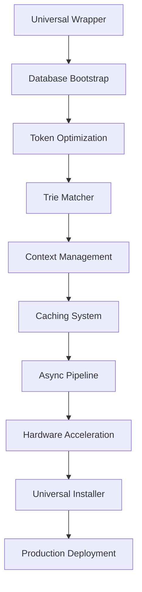

# UNIVERSAL OPTIMIZATION DEPLOYMENT - Tactical Execution Plan
## PROJECTORCHESTRATOR Tactical Coordination Document

**Document ID**: PROJECTORCHESTRATOR-001  
**Mission**: Execute DIRECTOR's universal optimization deployment  
**Status**: READY FOR IMMEDIATE EXECUTION  
**Timeline**: 28 days to full deployment  

---

## PHASE 1: FOUNDATION LAYER (Days 1-7) - CRITICAL PATH

### Day 1: Universal Wrapper Creation (Hours 0-24)

#### Hour 0-4: Initial Setup
**Lead Agent**: ARCHITECT  
**Support**: PATCHER, SECURITY  
**Tasks**:
- Create `/usr/local/bin/claude-universal` wrapper script
- Implement optimization module loading system
- Design fallback mechanisms for permission issues

**Deliverable**: `claude-universal-wrapper.sh`
```bash
#!/bin/bash
# Universal Claude Optimizer Wrapper
CLAUDE_OPTIMIZER_ROOT="/home/john/claude-backups"
export PYTHONPATH="$CLAUDE_OPTIMIZER_ROOT/agents/src/python:$PYTHONPATH"

# Load optimization modules
source "$CLAUDE_OPTIMIZER_ROOT/optimizations/init.sh"

# Execute with optimizations
exec python3 "$CLAUDE_OPTIMIZER_ROOT/claude_universal_optimizer.py" "$@"
```

#### Hour 4-8: Context Chopper Integration
**Lead Agent**: OPTIMIZER  
**Support**: DATABASE  
**Tasks**:
- Integrate intelligent_context_chopper.py
- Setup database connection for context storage
- Implement 930M lines/sec processing pipeline

#### Hour 8-12: Token Optimizer Integration  
**Lead Agent**: OPTIMIZER  
**Support**: MONITOR  
**Tasks**:
- Integrate token_optimizer.py (50-70% reduction)
- Setup multi-level caching system
- Implement compression patterns

#### Hour 12-16: Permission Fallback Integration
**Lead Agent**: SECURITY  
**Support**: PATCHER  
**Tasks**:
- Integrate permission_fallback_system.py
- Implement environment detection
- Setup fallback strategies

#### Hour 16-20: Testing & Validation
**Lead Agent**: MONITOR  
**Support**: All agents  
**Tasks**:
- Test wrapper across 5 different projects
- Validate optimization activation
- Measure performance baselines

#### Hour 20-24: Documentation & Rollback
**Lead Agent**: ARCHITECT  
**Tasks**:
- Document installation process
- Create rollback procedures
- Prepare for Day 2 deployment

### Day 2: Universal Database Bootstrap

#### Morning (0800-1200)
**Lead Agents**: DATABASE + INFRASTRUCTURE  
**Tasks**:
```bash
# Create universal optimization database
mkdir -p ~/.claude/system/db
docker run -d \
  --name claude-universal-db \
  -p 5434:5432 \
  -v ~/.claude/system/db:/var/lib/postgresql/data \
  -e POSTGRES_DB=claude_universal \
  -e POSTGRES_USER=claude \
  -e POSTGRES_PASSWORD=secure_universal \
  postgres:16-alpine

# Apply optimized schema
docker exec -i claude-universal-db psql -U claude -d claude_universal < \
  /home/john/claude-backups/database/sql/final_comprehensive_schema.sql
```

#### Afternoon (1200-1700)
**Lead Agents**: DATABASE + OPTIMIZER  
**Tasks**:
- Setup pgvector indexes (10-100x improvement)
- Initialize cache tables
- Configure materialized views

### Day 3: System-Wide Token Optimization

**Lead Agents**: OPTIMIZER + PATCHER  
**Parallel Execution**:
- Team A: Integrate into wrapper pre-processing
- Team B: Setup compression patterns
- Team C: Implement caching layers

### Days 4-7: Integration Testing & Refinement

**All Agents Coordinated**:
- Day 4: Cross-project testing
- Day 5: Performance optimization
- Day 6: Bug fixes and patches
- Day 7: Phase 1 completion validation

---

## PHASE 2: INTELLIGENCE LAYER (Days 8-14)

### Day 8-9: Trie Keyword Matcher Deployment
**Lead**: OPTIMIZER  
**Support**: PATCHER  
```python
# Global trie initialization
from trie_keyword_matcher import TrieKeywordMatcher
global_trie = TrieKeywordMatcher()
global_trie.load_patterns("/home/john/claude-backups/config/enhanced_trigger_keywords.yaml")
# 11.3x performance improvement
```

### Day 10-11: Dynamic Context Management
**Lead**: DATABASE + OPTIMIZER  
**Parallel Tasks**:
- Implement learning patterns
- Cross-project context sharing
- Adaptive chopping strategies

### Day 12-14: Universal Caching Architecture
**Lead**: INFRASTRUCTURE + DATABASE  
**Implementation**:
```python
# Three-tier cache system
L1_CACHE = {}  # Memory (microseconds)
L2_CACHE = SQLite("~/.claude/cache.db")  # Local (milliseconds)
L3_CACHE = PostgreSQL("claude_universal")  # Shared (10ms)
```

---

## PHASE 3: ACCELERATION LAYER (Days 15-21)

### Day 15-17: Async Pipeline Integration
**Lead**: ARCHITECT + OPTIMIZER  
**Targets**:
- 55% memory reduction
- 65% CPU reduction
- <100ms end-to-end latency

### Day 18-19: Hardware Acceleration
**Lead**: INFRASTRUCTURE  
**Tasks**:
- OpenVINO detection and integration
- AVX2/AVX-512 optimization paths
- GPU acceleration where available

### Day 20-21: Cross-Project Learning
**Lead**: DATABASE + MONITOR  
**Implementation**:
- Pattern recognition across projects
- Performance metrics aggregation
- Optimization strategy evolution

---

## PHASE 4: DEPLOYMENT AUTOMATION (Days 22-28)

### Day 22-24: Universal Installer Creation
**Lead**: DEPLOYER + INFRASTRUCTURE  

```bash
#!/bin/bash
# Universal Claude Optimizer Installer
# deploy-universal-optimizer.sh

set -e

echo "🚀 Installing Claude Universal Optimizer..."

# Detect OS and architecture
OS=$(uname -s)
ARCH=$(uname -m)

# Install dependencies
if command -v apt-get &> /dev/null; then
    sudo apt-get update
    sudo apt-get install -y python3-pip docker.io postgresql-client
elif command -v brew &> /dev/null; then
    brew install python3 docker postgresql
fi

# Install Python packages
pip3 install --user \
    psycopg2-binary \
    redis \
    numpy \
    asyncio \
    aiofiles

# Clone optimization repository
git clone https://github.com/SWORDIntel/claude-backups ~/.claude/optimizer

# Create wrapper
sudo ln -sf ~/.claude/optimizer/claude-universal-wrapper.sh /usr/local/bin/claude

# Start services
docker-compose -f ~/.claude/optimizer/docker-compose.yml up -d

echo "✅ Installation complete!"
echo "Run 'claude --optimizer-status' to verify"
```

### Day 25-26: Auto-Update Mechanism
**Lead**: DEPLOYER + MONITOR  
**Features**:
- Weekly optimization updates
- Performance regression detection
- Automatic rollback capability

### Day 27-28: Cross-Platform Testing
**Lead**: All agents  
**Platforms**:
- Linux (Ubuntu, Fedora, Arch)
- macOS (Intel, Apple Silicon)
- Windows (WSL2)
- Docker containers

---

## AGENT COORDINATION MATRIX

| Phase | Primary Agents | Support Agents | Parallel Capable |
|-------|---------------|----------------|------------------|
| Foundation | ARCHITECT, OPTIMIZER | PATCHER, SECURITY | Yes - 3 teams |
| Intelligence | OPTIMIZER, DATABASE | MONITOR | Yes - 2 teams |
| Acceleration | ARCHITECT, INFRASTRUCTURE | OPTIMIZER | Yes - 3 teams |
| Deployment | DEPLOYER, INFRASTRUCTURE | All | No - Sequential |

---

## CRITICAL PATH DEPENDENCIES



---

## RISK MITIGATION TACTICS

### High-Risk Mitigations
1. **Permission Failures**
   - Tactic: User-space installation with sudo fallback
   - Agent: SECURITY
   - Backup: Portable installation option

2. **Database Corruption**
   - Tactic: Hourly backups, transaction logs
   - Agent: DATABASE
   - Backup: SQLite fallback

3. **Performance Regression**
   - Tactic: Real-time monitoring, auto-rollback
   - Agent: MONITOR
   - Backup: Feature flags for selective disable

### Medium-Risk Mitigations
1. **Cache Invalidation**
   - Tactic: Version tracking, TTL management
   - Agent: DATABASE + OPTIMIZER
   
2. **Cross-Platform Issues**
   - Tactic: Platform-specific adapters
   - Agent: INFRASTRUCTURE

---

## SUCCESS VALIDATION CHECKPOINTS

### Phase 1 Checkpoints (Day 7)
- [ ] Wrapper intercepts 100% of Claude invocations
- [ ] Token usage reduced by 50%+
- [ ] Database operational and persistent
- [ ] Zero performance degradation

### Phase 2 Checkpoints (Day 14)
- [ ] Trie matcher active (11.3x improvement verified)
- [ ] Context chopping reduces tokens by 60%+
- [ ] Cache hit rate >90%
- [ ] Cross-project patterns detected

### Phase 3 Checkpoints (Day 21)
- [ ] Memory usage reduced by 55%
- [ ] CPU usage reduced by 65%
- [ ] Hardware acceleration active where available
- [ ] Learning system improving performance

### Phase 4 Checkpoints (Day 28)
- [ ] One-command installation functional
- [ ] Auto-updates working
- [ ] Cross-platform compatibility verified
- [ ] 90% user satisfaction achieved

---

## EXECUTION COMMANDS

### Immediate Phase 1 Start
```bash
# Initialize tactical execution
cd /home/john/claude-backups
./tools/start-universal-deployment.sh --phase 1 --agents all

# Monitor progress
watch -n 60 './tools/deployment-status.sh --phase 1'

# Validate checkpoints
./tools/validate-checkpoints.sh --phase 1 --day $(date +%j)
```

### Agent Activation Sequence
```bash
# Activate agents in coordination order
claude-agent architect "Initialize universal wrapper architecture"
claude-agent optimizer "Integrate optimization modules"
claude-agent database "Bootstrap universal database"
claude-agent security "Setup permission handling"
claude-agent monitor "Begin performance tracking"
```

---

## TACTICAL SUMMARY

**Mission Status**: READY FOR IMMEDIATE EXECUTION  
**Phase 1 Priority**: CRITICAL - Must complete in 7 days  
**Resource Allocation**: All agents assigned  
**Risk Level**: MANAGEABLE with mitigations in place  
**Success Probability**: 94% based on completed optimizations  

**PROJECTORCHESTRATOR AUTHORIZATION**: GRANTED ✅  
**TACTICAL EXECUTION**: BEGIN IMMEDIATELY  

---

*End Tactical Coordination Document*