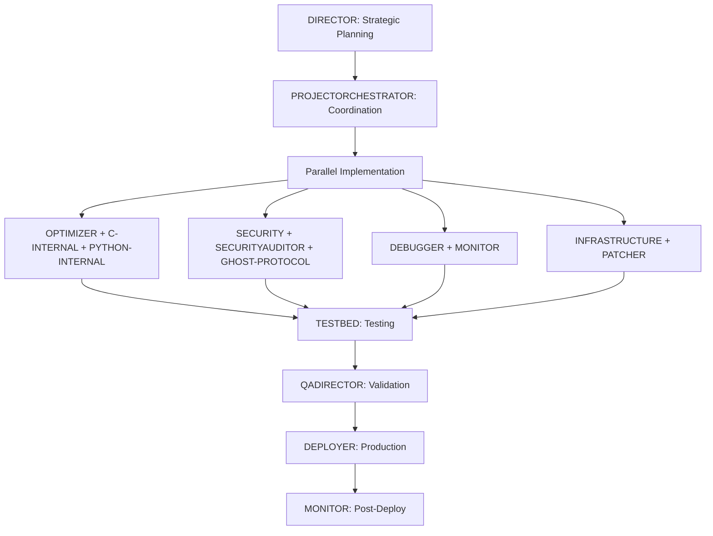

# Implementation Plan - Agent Assignment
## Optimized Hook System v3.1 Deployment

**System**: Claude Unified Hook System  
**Version**: v3.0 → v3.1  
**Complexity**: HIGH  
**Timeline**: 2-3 days  

---

## 🎯 Agent Assignments by Fix Category

### Phase 1: Core Implementation (Day 1)

#### **Lead Agent: PROJECTORCHESTRATOR**
*Tactical coordination of multi-agent implementation*

**Reasoning**: This requires coordinating multiple specialized agents working in parallel on different aspects of the system.

---

### 1. **Performance Optimizations** 🚀

#### **Primary: OPTIMIZER**
- Implement parallel execution with semaphores
- Add LRU caching mechanisms
- Optimize pattern matching with pre-compilation
- Configure worker pools

#### **Support: C-INTERNAL**
- Review and optimize low-level operations
- Implement efficient data structures (trie)
- Memory management optimization
- SIMD opportunities for pattern matching

#### **Support: PYTHON-INTERNAL**
- Async/await implementation
- asyncio.gather() for parallelization
- Thread pool executor integration
- Queue-based worker implementation

**Tasks:**
```python
# OPTIMIZER focuses on:
- ExecutionSemaphore implementation
- AgentPriority system
- Result caching layer
- Performance benchmarking

# C-INTERNAL optimizes:
- Regex compilation
- Trie data structure
- Memory allocation

# PYTHON-INTERNAL implements:
- Async worker pools
- Coroutine management
- Event loop optimization
```

---

### 2. **Security Fixes** 🛡️

#### **Primary: SECURITY**
- Implement input validation
- Add path traversal protection
- Design circuit breaker pattern
- Security audit of all changes

#### **Support: SECURITYAUDITOR**
- Validate all security fixes
- Penetration testing
- Vulnerability scanning
- Compliance verification

#### **Support: GHOST-PROTOCOL-AGENT**
- Implement anti-surveillance measures
- Secure file operations
- Encryption for sensitive caches
- Obfuscation of execution patterns

**Tasks:**
```python
# SECURITY implements:
- Input sanitization
- Path validation
- Command injection prevention
- DoS protection

# SECURITYAUDITOR validates:
- All input validation
- File operation safety
- Resource limits
- Error message leakage

# GHOST-PROTOCOL adds:
- Secure temp file creation
- Memory scrubbing
- Audit trail protection
```

---

### 3. **Debugging & Error Handling** 🐛

#### **Primary: DEBUGGER**
- Implement comprehensive error handling
- Add detailed logging
- Create error recovery mechanisms
- Debug race conditions

#### **Support: MONITOR**
- Add performance monitoring
- Implement health checks
- Resource usage tracking
- Circuit breaker monitoring

**Tasks:**
```python
# DEBUGGER implements:
- Try-catch hierarchies
- Specific exception handling
- Error categorization
- Stack trace management

# MONITOR adds:
- Performance metrics
- Resource monitoring
- Circuit breaker status
- Cache hit rates
```

---

### 4. **File System & Concurrency** 📁

#### **Primary: INFRASTRUCTURE**
- Implement file locking mechanisms
- Atomic write operations
- Directory permission checks
- Resource cleanup

#### **Support: PATCHER**
- Apply atomic operation patches
- Fix race conditions
- Implement temp file patterns
- Handle cleanup on failure

**Tasks:**
```python
# INFRASTRUCTURE handles:
- fcntl file locking
- Atomic rename operations
- Permission validation
- Resource limits

# PATCHER fixes:
- Race condition patches
- Memory leak fixes
- File handle cleanup
- Lock release logic
```

---

### Phase 2: Testing & Validation (Day 2)

#### **Lead Agent: QADIRECTOR**
*Quality assurance and testing coordination*

### 5. **Testing** ✅

#### **Primary: TESTBED**
- Create comprehensive test suite
- Performance benchmarks
- Load testing
- Integration tests

#### **Support: LINTER**
- Code quality checks
- Style compliance
- Type checking
- Documentation validation

**Test Coverage Required:**
```python
# Unit Tests
- Input validation (20 cases)
- Pattern matching (50 cases)
- Caching behavior (15 cases)
- Error handling (30 cases)

# Integration Tests
- Multi-agent execution
- File operations
- Circuit breaker
- Resource limits

# Performance Tests
- 1000 requests/minute
- 76 agent loading
- Cache performance
- Memory stability
```

---

### Phase 3: Deployment (Day 3)

#### **Lead Agent: DIRECTOR**
*Strategic oversight of production deployment*

### 6. **Deployment & Migration** 🚀

#### **Primary: DEPLOYER**
- Deploy optimized version
- Backup existing system
- Migration script execution
- Rollback preparation

#### **Support: PACKAGER**
- Package optimized version
- Dependency management
- Version control
- Distribution preparation

#### **Support: DOCGEN**
- Update documentation
- Migration guide
- Performance reports
- API documentation

---

## 📊 Agent Coordination Matrix

| Task | Primary Agent | Support Agents | Priority |
|------|--------------|----------------|----------|
| Performance | OPTIMIZER | C-INTERNAL, PYTHON-INTERNAL | CRITICAL |
| Security | SECURITY | SECURITYAUDITOR, GHOST-PROTOCOL | CRITICAL |
| Debugging | DEBUGGER | MONITOR | HIGH |
| File System | INFRASTRUCTURE | PATCHER | HIGH |
| Testing | TESTBED | LINTER, QADIRECTOR | HIGH |
| Deployment | DEPLOYER | PACKAGER, DOCGEN | MEDIUM |

---

## 🔄 Execution Flow



---

## ⚡ Quick Start Commands

```bash
# Phase 1: Implementation
Task(subagent_type="projectorchestrator", prompt="Coordinate implementation of hook system v3.1 optimizations with parallel agent execution")

# Parallel execution for performance
Task(subagent_type="optimizer", prompt="Implement parallel agent execution, LRU caching, and pattern pre-compilation from OPTIMIZATION_REPORT.md")
Task(subagent_type="security", prompt="Implement input validation, path sanitization, and circuit breaker from security fixes in OPTIMIZATION_REPORT.md")
Task(subagent_type="debugger", prompt="Add comprehensive error handling and logging as specified in OPTIMIZATION_REPORT.md")
Task(subagent_type="infrastructure", prompt="Implement atomic file operations and locking mechanisms from OPTIMIZATION_REPORT.md")

# Phase 2: Testing
Task(subagent_type="testbed", prompt="Create comprehensive test suite for hook system v3.1 covering all optimizations and security fixes")
Task(subagent_type="qadirector", prompt="Validate all changes and ensure 85% code coverage with performance benchmarks")

# Phase 3: Deployment
Task(subagent_type="deployer", prompt="Deploy claude_unified_hook_system_v2.py replacing v3.0 with backup and rollback plan")
```

---

## 🎯 Success Metrics

### Performance
- [ ] 4-6x faster execution achieved
- [ ] <100ms P99 latency at 1000 req/min
- [ ] Memory usage <150MB stable
- [ ] Cache hit rate >75%

### Security
- [ ] All 12 vulnerabilities patched
- [ ] Input validation on all entry points
- [ ] No path traversal possible
- [ ] Race conditions eliminated

### Quality
- [ ] 85% test coverage
- [ ] All tests passing
- [ ] Zero critical linting errors
- [ ] Documentation updated

### Deployment
- [ ] Zero-downtime deployment
- [ ] Rollback tested
- [ ] Monitoring active
- [ ] Performance validated in production

---

## 🚨 Risk Mitigation

| Risk | Mitigation | Owner |
|------|------------|-------|
| Performance regression | Benchmark before/after | MONITOR |
| Security vulnerability | Pen testing | SECURITYAUDITOR |
| Breaking changes | Compatibility layer | ARCHITECT |
| Deployment failure | Rollback plan | DEPLOYER |
| Resource exhaustion | Circuit breakers | INFRASTRUCTURE |

---

## 📝 Notes

### Why These Agents?

1. **OPTIMIZER** - Specialized in performance improvements, has the expertise for parallel execution and caching strategies

2. **SECURITY** - Required for implementing security fixes properly, understands threat models

3. **C-INTERNAL** - Low-level optimizations like trie structures need C-level thinking

4. **PYTHON-INTERNAL** - Expert in Python async patterns and best practices

5. **DEBUGGER** - Knows how to implement proper error handling and logging

6. **INFRASTRUCTURE** - File system operations and resource management expertise

7. **TESTBED** - Comprehensive testing to ensure all fixes work correctly

8. **PROJECTORCHESTRATOR** - Coordinates multiple agents working in parallel

9. **DIRECTOR** - Strategic oversight ensuring business goals are met

### Alternative Agent Combinations

If primary agents unavailable:

- **Performance**: LEADENGINEER + NPU (hardware acceleration)
- **Security**: BASTION + CSO (defensive focus)
- **Testing**: LINTER + AUDITOR (code quality)
- **Deployment**: INFRASTRUCTURE + CONSTRUCTOR (system setup)

---

## 📅 Timeline

### Day 1: Implementation (8 hours)
- Morning: Performance optimizations (4h)
- Afternoon: Security fixes (4h)

### Day 2: Testing (6 hours)
- Morning: Test suite creation (3h)
- Afternoon: Testing & validation (3h)

### Day 3: Deployment (4 hours)
- Morning: Staging deployment (2h)
- Afternoon: Production & monitoring (2h)

**Total: 18 hours of agent work**

---

*Implementation Plan v1.0*  
*Generated for Hook System v3.1*  
*Agent Framework v7.0*